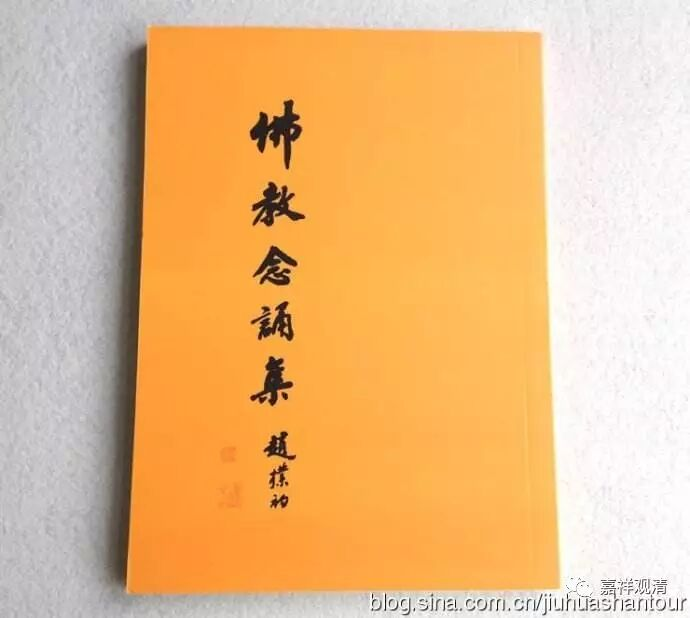
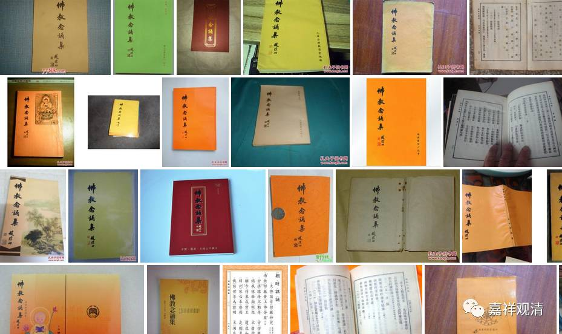

**现在中国佛教属于哪个部派？**

佛教的部派很多，命名也很多样，比如“根本说一切有部”，从他的部派核心立场来说，因为他持蕴处界、三世一切有，所以称为“说一切有部”；又因为主流奉《大毗婆娑论》，故又称为“毗婆沙师”，这是从主要的经典来命名。从地方来说，他的核心教团在克什米尔，称为“迦湿弥罗有部师”，另有在健陀罗的有部师，因为在克什米尔以西，所以称作“西方师”、“日下师”或“外国师”；其在摩揭陀国的有部师，也因地域的原因被称为“中原师”。

今天中国佛教，一般大家从流传地域立论，都称做“汉传汉语系佛教”，和“藏传藏语系佛教”、“南传巴利语系佛教”鼎足而三，是世界佛教三大系之一。其中，“汉传汉语系佛教”和“藏传藏语系佛教”又统称为“北传佛教”，北传，也通常自称“大乘佛教”。

“有人说”：在今天之震旦，总的来说，尽管禅、净、律、密、台、贤、性、相各宗都存在，但所有的寺院都在念《佛教念诵集》所载的早晚课，几乎所有的出家人都能流利地背诵，他们“度牒”的得否也视能否背诵早晚课而定；除少许音调的屈曲婉转以外，各地诵法也都并无多少实质之差别；绝大部分信众除早晚课以外也不再知道（也不想知道）其它什么佛教内容了……所以，基于上述原因，今之神州所传部派，后人恐怕会送名为——

** 早晚课宗！**

