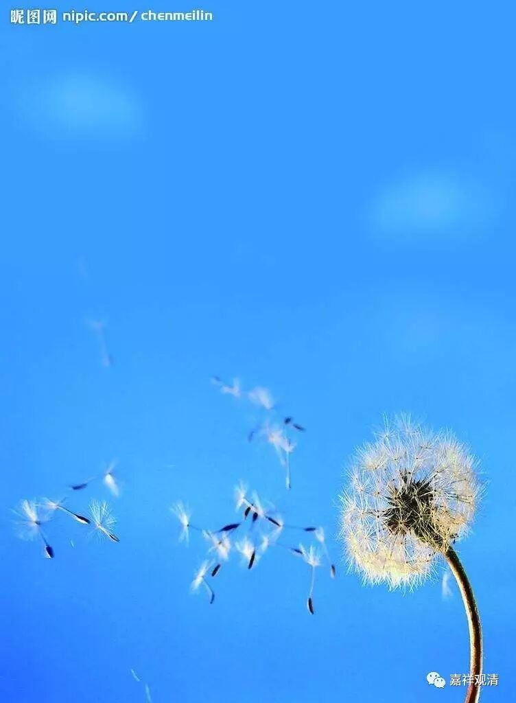

**《每日一偈》第八辑**

刹那迁流，非可暂住；

逝者如斯，无常迅速！

先调琴弦，然后作乐；

初当闻思，继起习修。

见三有可畏，非怖不顺遂；

有戒勤比丘，远离于渴爱。

无明所缚，爱染所系；

若不出离，长夜流转。

世间皆虚诳，染溺故迷醉；

缘起之扼要，正知离系缚。

此有故彼有，此生故彼生，

诸法待因缘，云何有自性？

方便净土门，世尊悲田出；

然漏未尽时，非终可保信。

恭敬善知识，一心求多闻，

惭愧远利养，不动如山王。

道自无南北，根须有利钝；

但得善士引，一路涅槃门。

金屑虽贵，落眼成翳；

菩提至真，执实则障。

色不自色，故色性空；

非待坏色，而后曰空。

未辨灯是火，炊烟迟迟不起；

若证法性空，群生早早得脱。

世尊甘露语，引众出生死；

故诸教法藏，仁者当多闻。

若于佛法请教授，勿求但顺己欲师；

世欲无非三毒作，慎勿买椟还明珠。

仅于无我法，少分得相应，

亦胜无边劫，殷勤七宝施。

雾霾浓浓，若未逃脱亦极生热恼；

生死重重，至今沉溺可不思出离？

虚空无心智，外道无解脱。

无物堪比伦，唯此一真实。

此身唯衰损，众苦所随逐；

智者善知此，无间起出离。

形骸速朽去，曾不得暂住；

当速趋正法，昼夜取坚实。

佛旨一味，异说纷纭；

我只一句，缘起性空！

兽归林薮，鸟归虚空，

圣归涅槃，法归分别。

——《大毗婆沙》引经

