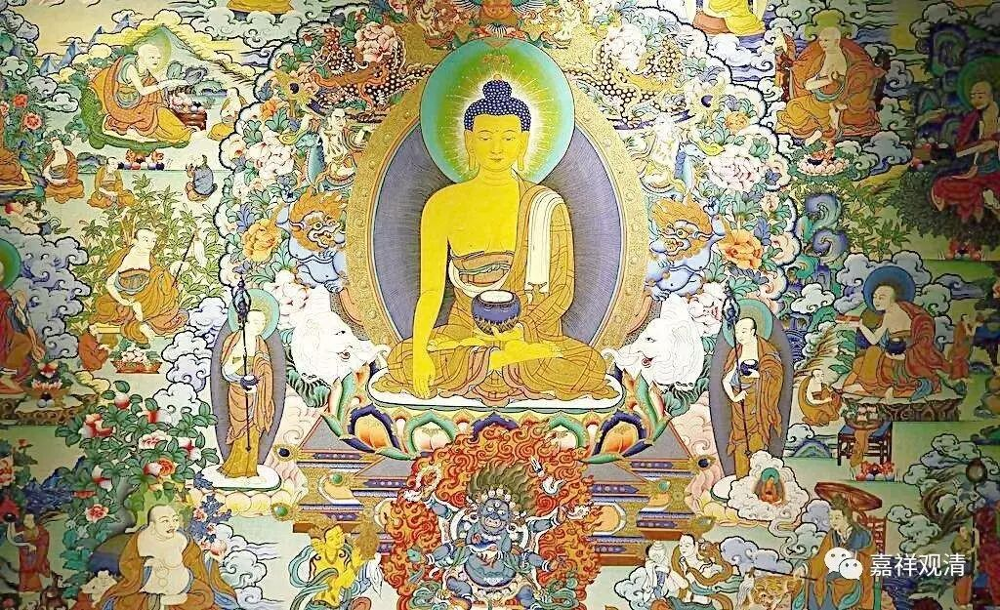

**成佛知否**

《大毗婆沙论》卷一七六：

** 是故菩萨乃至初无数劫满时，虽具修种种难行苦行，而未能决定自知作佛；**

** 第二无数劫满时，虽能决定自知作佛，而犹未敢发无畏言“我当作佛”；**

** 第三无数劫满修妙相业时，亦决定知“我当作佛”，亦发无畏狮子吼言“我当作佛”。**

这是有部的通说。

有部认为，释迦菩萨（亦泛指一切菩萨）自从在“古释迦牟尼佛”面前发心“愿成佛”一直到菩提树下金刚坐上最后一座之前，都还是凡夫。其间经历了三大阿僧祇劫修福德，九十一劫修相好。菩萨在第一大阿僧祇劫结束（开始第二大阿僧祇劫）时，尚未能确定自己能不能成佛；到第二大阿僧祇劫圆满（开始第三大阿僧祇劫）的时候，已经知道决定成佛，但还不敢说“我当作佛”（是自信心不够吗？）到第三大阿僧祇劫结束，开始“百劫修相好”（对释迦菩萨而言是九十一劫，因为中间超越九劫）的时候，决定知自当成佛，也能发无畏之声——“我当作佛”。

这和一般大乘说的不同了。一般大乘佛教说：通常，菩萨之资粮道和加行道，为第一大阿僧祇劫；自大乘见道至第七地满，为第二大阿僧祇劫；八、九、十这三地为三清净地，至十地满心成佛这是第三大阿僧祇劫。其中，第一大阿僧祇劫是否决定知道“我当作佛”似乎并未多谈。但部派佛教里的大众部认为，自初发心以后的菩萨便能决定知道“我当作佛”。

若依《法华》、《涅槃》，则释迦早已成佛，“三大阿僧祇劫成佛”也只是化现而已。若依圣龙树之《大智度论》，则说“三大阿僧祇劫成佛”定非决定，但凡断证圆满便成正觉，并不会机械地按照时间长短来成佛——真是说得痛快！

