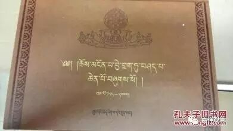

**婆沙师如何许二谛？**

藏地诸宗义书，皆说婆沙师许二谛如《俱舍论》：“彼觉破便无，慧析余亦尔，如瓶水世俗，异此名胜义。”就是说，（有分）能够被拆分的法就是世俗谛，不能被拆分（分）的法就是胜义谛。

但拣寻《大毗婆沙论》原文，发现婆沙罗列了多种二谛说，却并无类似《俱舍》的破析二谛说。而《婆沙》的正义，是由四谛而谈二谛的。

检《大毗婆沙论》卷七十七：

“……四谛皆有世俗、胜义：

苦、集中有世俗谛者，义如前说。（前文谓：于四谛中，前二谛是世俗谛，男、女、行、住及瓶、衣等，世间现见诸世俗事，皆入苦、集二谛中故。）

苦谛中有胜义谛者，谓苦、非常、空、非我理。

集谛中有胜义谛者，谓因、集、生、缘理。

灭谛中有世俗谛者，佛说灭谛如园、如林、如彼岸等；灭谛中有胜义谛者，谓灭、静、妙、离理。

道谛中有世俗谛者，谓佛说道如船栰、如石山、如梯隥、如台观、如花、如水；道谛中有胜义谛者，谓道、如、行、出理。

由说四谛皆有世俗、胜义谛故，世俗、胜义俱摄十八界、十二处、五蕴、虚空、非择灭亦二谛摄故。……”

此即汉地毗昙师总结的（亦即嘉祥吉藏大师评破的）“理事二谛”说。

所引《婆沙》，文末说二谛“俱摄十八界、十二处、五蕴；虚空、非择灭亦二谛摄故”，这是说二谛“摄”一切法，而非如《俱舍论》许一切法分为二谛。又，这里的二谛之“摄”一切法，亦通尊者世友“于”凡圣视角立“于”二谛，和大德法就取“言说”义立“教”二谛。（即嘉祥吉藏大师所云“於教二谛”）

引文末，《婆沙》谓“虚空、非择灭亦二谛摄故”，而未及有部所许“三无为”之“择灭”，可能是：

1、择灭唯属胜义（但此说似不合“世俗、胜义俱摄十八界、十二处”之文）；

2、虽分属胜义，理亦通二（但独不标举，不知何故）；

3、或“非择灭”实为“二择灭”之误写（？）。

此当寻《婆沙》另两个版本，再再考查！

汉地现存关于印度部派佛教之资料可说丰富，或可补藏传于初中期佛教资料欠缺的不足。尊法师译《婆沙》为藏文，作为证义大德的东本格西数数击节，叹未曾有。若此论能得到三大寺广泛研习，当有益于我们对有部更深入的解读。

