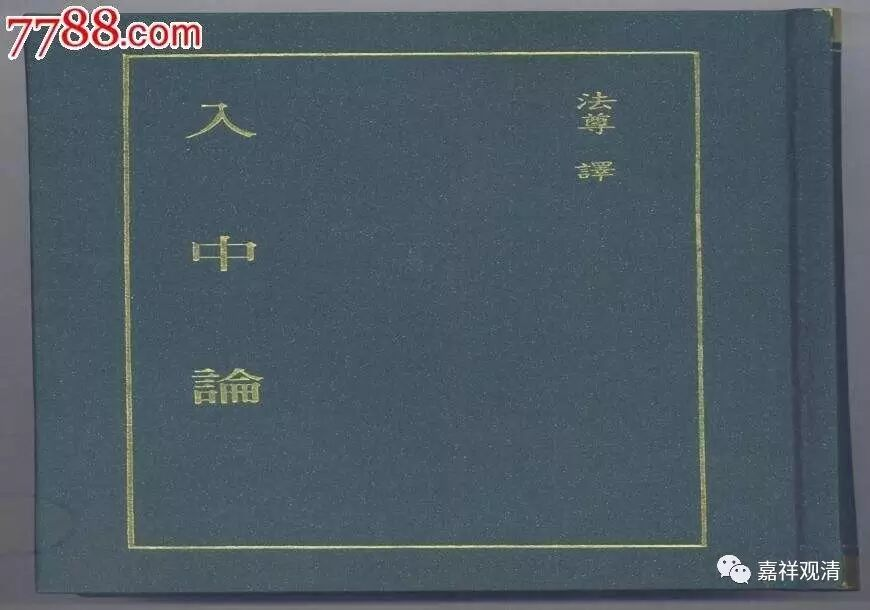

**《金刚经》013（中）**

关于菩提心，还有一个最近常见的问题。

月称论师的《入中论》第一颂说：** “声闻中佛能王生，诸佛复从菩萨生，大悲心与无二慧，菩提心是佛子因。”**这里的** “菩提心”**，有些宗派的堪布在讲《入中论》的时候，把它当作“世俗菩提心”来讲——这里面也是有问题的！假如这里的“菩提心”是指世俗菩提心的话，那么，具备“世俗菩提心”的，前面说过，就已经是菩萨了，就已经是“佛子”了，怎么这个“菩提心”还“是佛子因”呢？“世俗菩提心”的获得和成为“菩萨”是同时安立的，怎么可以说同时生起或安立的两个法有因果关系呢？难道想许“因果同时”吗？……不知道这些问题，这些“堪布”们仔细想过没有？所以，《入中论》这里“菩提心是佛子因”的这个“菩提心”，是指“因位上的菩提心”，并非真实的菩提心，我们称为“如甘蔗皮之菩提心”，也就是菩提心七因果教授中的最后一个。它还不是任运地生起的世俗菩提心，要到任运生起时才是真正的菩提心哦！这一颂里的“菩提心”，还只是一个菩提心的雏形、预备状态。

当然，我们这里（《金刚经》）讲的菩提心是指大乘的菩提心。我们之前说过，在声闻乘的经典当中也会有菩提心的说法，但它不是指大乘的菩提心，而是指声闻乘的趋向于解脱的心。《金刚经》在这里就讲得比较清楚——“发阿耨多罗三藐三菩提心”，发起（欲求）无上正等正觉的心，这个肯定是大乘的真实的菩提心。

前面在问：** “应云何住？应云何修？应云何降伏其心？”**这一段是在讲“应云何住”，要想证得胜义菩萨，就不能有自性执。

**
**

** “何以故？须菩提，若菩萨有我相、人相、众生相、寿者相，即非菩萨。”**这一段在玄奘法师的译本当中是八个排比：** “若诸菩萨摩诃萨，不应说言有情想转，如是命者想、士夫想、补特伽罗想、意生想、摩纳婆想、作者想、受者想转……”**这里有八事排比，再说一遍，是并列关系。

那么，讲完了“应云何住”，接下去就是“应云何修”。在鸠摩罗什法师的版本当中，“应云何修”这句话是没有译出来的，而在玄奘法师和义净法师的版本中都是有的：** “应云何住？应云何修？应云何降伏其心？”**那么下面这段就是讲“应云何修”的。

