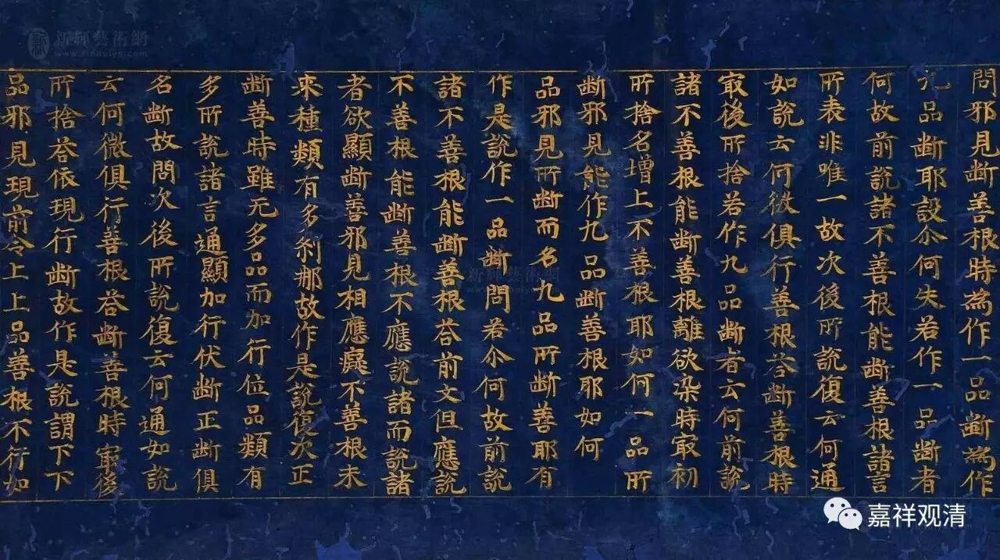

**有部三大论师的四种“二谛说”**

《大毗婆沙论》卷七十七：

** 问：世俗、胜义，亦可施设各是一物不相杂耶？**

** 答：亦可施设。**

** （问：）其事云何？**

** （答：）尊者世友作如是说：能显名是世俗，所显法是胜义。**

** 复作是说：随顺世间所说名是世俗，随顺贤圣所说名是胜义。**

** 大德（法就）说曰：宣说有情、瓶、衣等事，不虚妄心所起言说是世俗谛；宣说缘性、缘起等理，不虚妄心所起言说是胜义谛。**

** 尊者达罗达多说曰：名自性是世俗——此是苦、集谛少分；义自性是胜义——此是苦、集谛少分，及余二谛、二无为。**

关于《俱舍论》的“一切法”分为“世俗”和“胜义”二谛的说法，《婆沙》卷七十七也提到了，但是说“世俗、胜义，亦可施设各是一物不相杂耶？答：亦可施设。”这是说：“能不能说世俗胜义二谛是各别独立、不相混杂的呢？回答：也可以这么说……”“亦可施设”，表明这不是婆沙师所持的正义。

婆沙引来三个论师的解说——世友、法就、达罗达多。

尊者世友说：“能显名是世俗，所显法是胜义。”这是从名义差别来理论。名言是世俗，名言所诠是胜义。有说此即《俱舍》之二谛说，但此二差别很大。《俱舍》二谛皆是所显之法，皆属此处之胜义。

世友的“复次说”：“随顺世间所说名是世俗，随顺贤圣所说名是胜义。”其从言说来分别，略同大德法就。另从“随顺世间”和“随顺贤圣”来分别世俗、胜义二谛，今之宁玛有释二谛者似乎略近此说。

大德法就说：“宣说有情、瓶、衣等事，不虚妄心所起言说是世俗谛；宣说缘性、缘起等理，不虚妄心所起言说是胜义谛。”明显是言说二谛，二谛之差别，在是否虚妄心所起。此略同世友之“复次说”。（世友之“复次说”，略同“于二谛”，法就之说，略同“教二谛”。）

尊者达罗达多说：“名自性是世俗——此是苦、集谛少分；义自性是胜义——此是苦、集谛少分，及余二谛、二无为。”仍从前文“四谛说”而来，彼谓：灭道二谛必属胜义；苦集二谛，则有世俗有胜义——名是世俗，义是胜义。在苦集二谛的分别上立“名义”差别二谛，略同世友的“名法差别”。

可以注意的，达罗达多说仍旧说“二无为”，难道还是前文的“虚空、非择灭”？那“择灭无为”呢？

