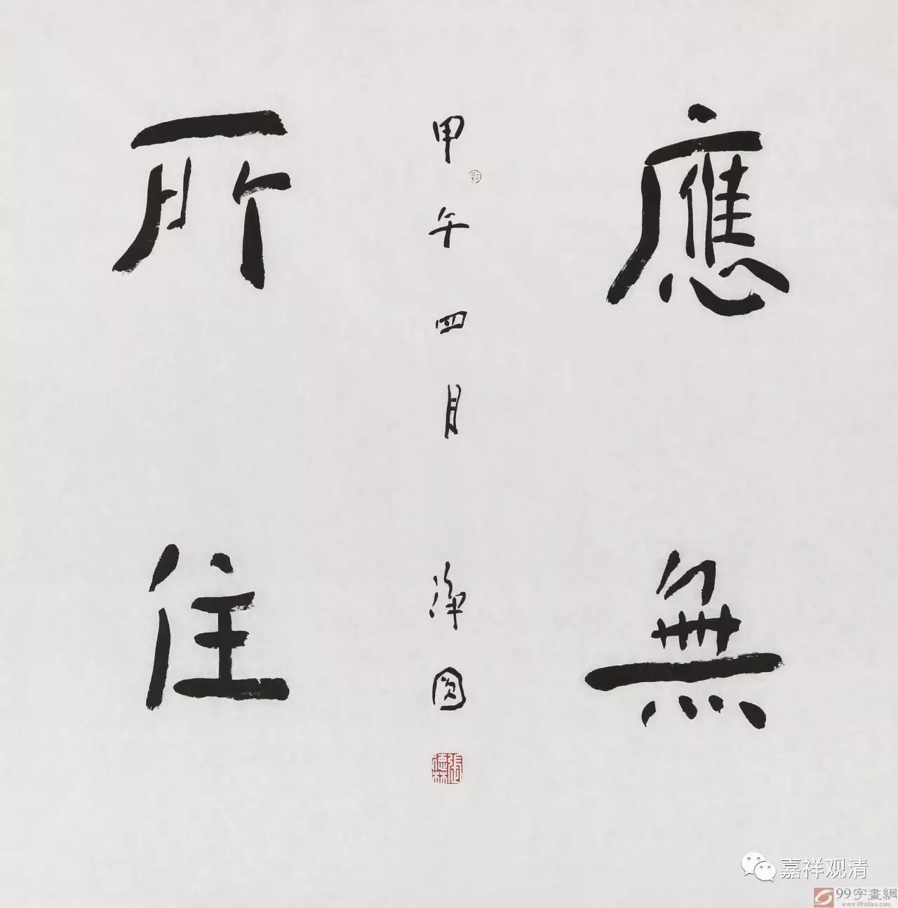

**《金刚经》013（下）**

讲“应云何修”的时候举了个例子。

** “复次，须菩提，菩萨于法，应无所住行于布施，所谓不住色布施，不住声、香、味、触、法布施。”**这段在讲什么呢？既然已经发起菩提心了，那么接下来应该怎么做。前面是讲** “所有一切众生之类，若卵生、若胎生、若湿生、若化生……，我皆令入无余涅槃而灭度之”**。是要让一切的有情能够得到究竟的涅槃的果位。那么发起了这样的心以后，我们应该怎么做呢？“应云何修”呢？这里就以布施作为例子来讲，因为布施是六波罗蜜多的第一个，所以先把它拿出来讲。

** “复次，须菩提，菩萨于法，应无所住行于布施，”**菩萨在修布施的时候应该“无所住”。“无所住”，不是我们现在通常讲的“不要执着”。现在很多人都把这句话理解为：“你不要太认真，不要执着，应无所住行于布施……”其实不是这个意思。这个“住”，是指不要耽着，不要“三轮实有”。因为布施是由能布施的人、被布施的人和布施这件事情或者布施的东西这三者合起来，才会有布施这个事情，对吧？所以布施是缘起有，布施不是实有。那其他一切诸法也是这样的，持戒、忍辱、精进、禅定、智慧，也都是一样，也是缘起有、依缘而生。比如持戒有能持、所持,忍辱有能忍、所忍……都是一样，所有这一切都是缘起无自性的。

在《入中论》等中也都提到了，假如说你不能达到“三轮体空”，那就不是波罗蜜多，就仍然是世间的布施，你还是凡夫。其实在前面已经先立下了，这里指的是圣者菩萨，那么应该是要“不住相布施”。这个“相”，不是指“不要着相”，不是！这个“相”是指自性，不要认为这是有自性的，不要认为布施这件事情是实有的，不要认为任何一件事情是实有的——这才是“不着相”的意思。我们现在把“不着相”已经讲得很简单了，是吧？要是以后我们在外面听到“不着相”，千万不要认为是“别太认真”的意思，没有这个意思。这就是僧肇大师批评的“汝但无心于万物，万物未尝无”了。

这一段是佛在教导菩萨应该怎么修，应该不要以实有的见去布施，应该在布施的同时能够观察到布施的“三轮体空”，能够知道布施无自性。应该不住色、声、香、味、触、法地去布施，在布施的时候不执着，不要认为色、声、香、味、触、法等等都是有自性的。

如果在《大般若经》当中，从色乃至一切法，都会一个个地罗列出来，从五蕴——色、受、想、行、识，到十二处、十八界……一直到佛的一切种智。这个也无自性，那个也无自性，最后都是无自性，为什么呢？“性自尔”，都是这样。那么，在《金刚经》、《心经》当中就比较简略，略了以后就会提到一部分，这里就讲“不住色、声、香、味、触、法布施”。

总的来讲就是有一百零八法，从“色”乃至究竟的“一切种智”，也就是说，一切的法都无自性。在修行的时候也是一样，这里以布施作为例子。持戒、忍辱、精进、禅定、智慧，再加上后面的方便、愿、力、智，都是一样的，不要认为这个当中的任何一法是实有的，从“色”乃至佛陀的“一切种智”，都不是实有的。我们讲《心经》的时候已经讲过了，对吧？你们如果有兴趣的话，可以看一看法尊法师讲“一百零八句法”的文章，可以去查一下的，法尊法师写过这样一篇文章。在汉地的藏经当中也有一段是施护法师翻译的关于一百零八法的一个陀罗尼——总持，他也讲了《般若经》当中的一百零八法是什么，篇幅不大，大家可以看一下。

这里的“不住色、声、香、味、触、法布施”，只是提个头。在《大般若经》当中，会把从色乃至一切种智的一百零八法全部排出来。《金刚经》只有八百颂，篇幅不大，所以就举出一些个别的法，六度当中也只举出一个布施作为例子。

好，今天先讲到这里，明天继续吧。

