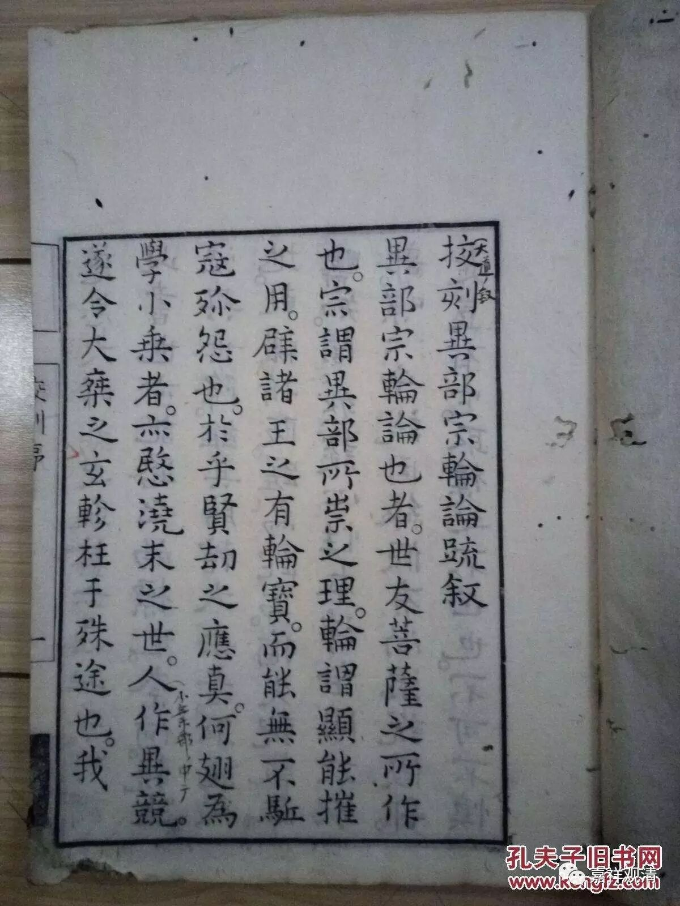

《成实论》和分别说系的关系

接着谈谈《成实论》和法藏部（分别说系）的关系。

据嘉祥吉藏《三论玄义》：

“问：（诃梨）跋摩既排斥《八犍》（《发智论》），陶汰五部，《成实》之宗正依何义？

答：有人言：择善而从，有能必录；弃众师之短，取诸部之长。

有人言：虽复斥排群异，正用昙无德（法藏）部。

有人言：偏斥毗昙（有部），专同譬喻（经部）。

真谛三藏云：用经部义也。

检《俱舍论》，经部之义多同《成实》。”

吉藏大师说：

有人问：狮子铠论师排斥有部，又出入各宗，那《成实论》本身属于那一部派？

回答：第一说：择善而从，理长为宗。

第二说：正属法藏部。

第三说：（经部）譬喻师。

第四说：据真谛三藏说，属经部。

最后评点：从《俱舍论》引文来对照，《成实论》当属经部宗。

这里最后判定，《成实》属譬喻师、经部宗一系的观点。其实这段文字其它几说大同小异，都指出《成实论》应该属于经部的论书，但这里还提到了另一个说法——“法藏部”。粗看觉得很突兀，细究下来，却有可观！

检《成实论》卷二，谈到部派佛教的种种差异之处，重点有十：

“问曰：汝经初言广习诸异论，欲论佛法义，何等是诸异论？

答曰：于三藏中多诸异论，但人多喜起诤论者，所谓：

1. 二世（过去、未来）有、二世无；

2. 一切有、一切无；

3. 中阴有、中阴无；

4. 四谛次第得、一时得；

5. （预流、阿罗汉）有退、无退；

6. 使（随眠）与心相应、心不相应；

7. 心性本净、性本不净；

8. 已受报（过去已与果之）业或有、或无；

9. 佛在僧数、不在僧数；

10 有人（补特伽罗）、无人。”

而“成实师”此十项自许则为：

一、二世无──过去未来是非有的。

二、一切有与一切无，是方便说，第一义谛是非有非无的。

三、没有中阴。

四、一时见谛（顿见）。

五、阿罗汉不退。

六、心性不是本来清净的。

七、使（随眠）与心相应。

八、过去是无。

九、佛不在僧中。

十、无我。

据《异部宗轮论》，化地部许：

其化地部本宗同义：谓过去未来是无，现在、无为是有；四圣谛一时现观，……定无中有；……诸阿罗汉定无退者；……僧中有佛……

除“僧中有佛”外，略同《成实》。而，从化地部分出的法藏部持“佛非僧中可得”，认同“佛不在僧中”（见真谛译《部执异论》）。《三论玄义》之第二说，判《成实论》属法藏部，或即由此。（印顺法师对《三论玄义》之第二说，认为是“或由见灭得道”，但此说似不易成立。）

因论生论：

据吕澄先生（《略论南方上座部佛学》）说，南传上座部在其《论事》中表明，他们有持这几个观点：

“(1)过去未来法无体；(2)并非一切都实有；(3)四谛可以顿得现观；(4)一定没有‘中有’；(5)阿罗汉不退；(6)没有真实的补特伽罗……（7、）佛不在僧数……”

这七条近乎全同《成实论》！

那是不是说《成实论》就是南传上座部，或者法藏部、化地部的论书呢？不是！

化地部、法藏部、南传上座部，和饮光部，皆属于“分别说系”一支，和有部为“叔伯兄弟”（“大众系”之于“上座系”，则为“一表三千里”的远房兄弟了），皆自“上座部”分流而出。而经部乃最后从“有部”分化而出，《成实》论主对老大（有部）有意见（论议不合），出来后，一脑袋扎到到堂兄弟家里找粮食去了。所以经部有些观点“偏斥有部”，反而和分别说系统靠近了。这并不是说“《成实》师”就是分别说系的论师，只是表明，经部和分别说系（这些堂兄弟）的观点常常很相近。

