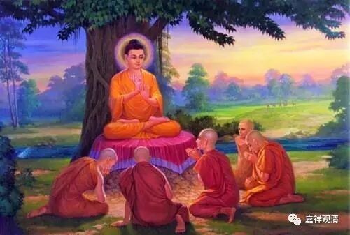

分别说部的四谛

属于经部师的尊者婆薮跋摩著有《四谛论》，抉择法义，分别四谛。其中提到分别说部的四谛说法，与常见的“知苦、断集、证（慕）灭、修道”略有不同。据《四谛论》卷一：

**“又分别部说：**

** 一切有为皆苦，由无常故——（此）非初谛故苦。为离此故，于世尊所修净梵行，是苦圣谛。**

** 一切因皆名集，以能生故——（此）非第二谛故集。为断此故，于世尊所修净梵行，是集圣谛。**

** 一切有为寂离名灭，由寂静故——（此）非第三谛故灭。为证此灭，于世尊所修净梵行，是灭圣谛。**

** 一切善法皆是道，能出离故——（此）非第四谛故道。为习此道，于世尊所修净梵行，是名圣谛。”**

这是说：通常所说的“一切有为法无常故苦”、“一切能生苦之因名集”、“一切有为（有漏）寂静故灭”、“一切能出离之善法是道”皆非四圣谛，而许，“离此苦”、“断此集”、“证此灭”、“习（修）此道”的“世尊所修净梵行”，“是四圣谛”。从“世尊所修净梵行”来安立为四谛的“谛”，这似乎是偏向于从修行的角度立论。是偏向于实践的四谛论，而不是倾向于知识的四谛说。

对于苦谛，“离苦”和“知苦”的差别也可以看出这种不同的倾向。“知苦”，作为佛教内部（或者说有部系、梵语系）的通说，是偏向于认知、知识层面的；而“离苦”，是一种行为导向的——这就是通常所说的，“知”和“行”的差别了。“知”与“行”，此二者或可互通、互训，但从实践角度来说，行（离苦）比知（知苦）是要更强调主动性的，也更深探了一层。

就解脱、实践意义上，分别说部的这种“四谛说”，可以说也是一种“行为的四谛说”。

“这些是苦，你应该知道，要远离！”

