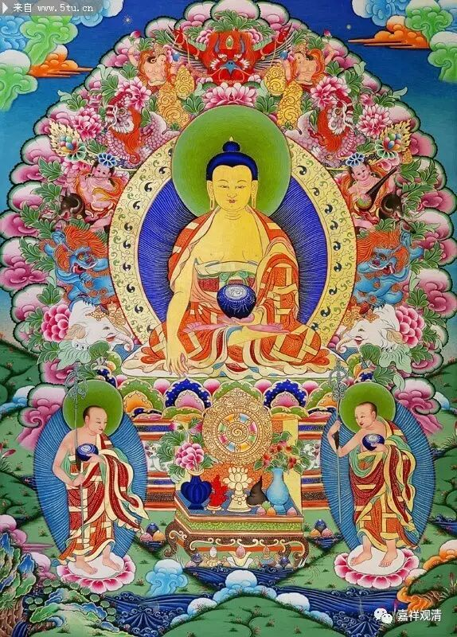

相好随缘

世皆说化身佛具三十二相，八十种好。但，这是一定的吗？余诸宗派或视为定论，敷衍成篇，而中观派则不然。龙树大师在《大智度论》卷八十八说：

***“复次有人言：佛菩萨相不定。如此中说，随众生所好可以引导其心者为现。又众生不贵金而贵余色琉璃、颇梨、金刚等。如是世界人、佛则不现金色、观其所好、则为现色。又众生不贵纤长指及网缦，以长指利爪为罗刹相，以网缦为水鸟相，造事不便，如着手衣。何用是为？如罽宾国弥帝隶力利菩萨，手网缦，其父恶以为怪，以刀割之，言：“我子何缘如鸟。”有人不好肩圆大以为似肿；有以腹不现无腹如饿相；亦有人以青眼为不好，但好白黑分明。是故佛随众生所好而为现相好，如是等无有常定。***

*** ***

***……又于三千大千世界，随可度众生处生，则为现相。如《密迹经》中说：“或现金色，或现银色，或日月星宿色，或长或短，随可引导众生，则为现相。”随此间阎浮提中天竺国人所好，则为现三十二相。天竺国人于今故治肩膊，令厚大，头上皆以有髻为好。如人相中说五处长为好，眼鼻舌臂指髀手足相，若轮、若莲华、若贝、若日月。是故佛手足有千辐轮、纤长指、鼻高好、舌广长而薄，如是等皆胜于先所贵者故，起恭敬心。有国土，佛为现千万相，或无量阿僧祇相，或五、六、三、四相。随天竺所好故，现三十二相，八十种随形好。”***

意思是，惯常所说的“三十二相八十种好”并非一定之说。若彼时彼地不贵金色，则不现金色而现余色——比如白种人里面肯定现“银色”，黑人里现黑色……又比如，长指、网蔓，世人或视为灾异而厌恶。

龙树大师举例说，曾经，克什米尔有位慈吉祥菩萨，生而指带网蔓，其父以为不祥，说：“我儿子怎么搞的像鸟一样！”竟用刀割开（呃，生不逢时的菩萨啊……）。其他身相也是一样，有些身相在此地尊贵而在异地视为怪异，这都并非一定。故佛现形好，“无有常定”。

中印度人以此三十二相八十种好为尊贵，故释迦菩萨垂现彼相。若余国土，或有百千万乃至无量相好，或有三五相好，皆不必然。

这样说来，所谓相好，既未有一定的形象，也未有一定的数量。通常所说的三十二相八十种好，只是一种民俗，约定俗成而已，不需过分执实！

龙树大师立意，常常类此，痛快淋漓，直指症结。后人无此证量，常常附会因循，死于言下。诚祈大师再来，菩萨垂迹，收拾娑婆之纷纭诸说，廓清宇内，一正是非！

