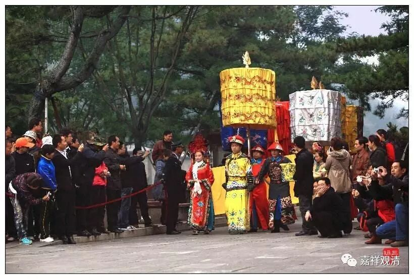

**（国王：其实我是一个演员）**

** 《金刚经》014（下）**

对于菩提心的发心，还要分三种发心情形：第一种叫国王式的发心；第二种叫牧童式的发心（牧童就是放牧的孩子）；第三种叫船长式的发心，又叫舟师式的发心（舟就是船，师就是师父，舟师就是船长）。

第一种国王式的发心，是什么呢？就是我先成佛，然后带大家一起成佛。这是比喻，用国王来比喻，为什么呢？因为国王是先进城或者先出城，大臣们才从后面出来。这个当然是一种比喻，比喻那种“我先成佛，然后带大家一起成佛”这样的发心，因为比较急切地想要度众生。

第二种是牧童式的发心，就是把羊啊、牛啊都赶进圈里面，他自己最后一个把门关上，也就是“所有众生都成佛以后，我才成佛”。这就是牧童式的发心，等所有的羊都进了羊圈以后，我最后一个关门。

第三个呢，叫船长式的发心，愿与法界众生一起同证阿耨多罗三藐三菩提，比喻像船长一样，是和同船的人一起到达彼岸的。

第一种发心的情况，比如释迦牟尼佛，还有很多密宗的。其实大部分的情况都是第一种。第二种呢，像“地狱不空，誓不成佛”这种都还算不上，说的仅仅是地狱。应该是像普贤菩萨的“乃至虚空界尽，我愿乃尽。以虚空界（是法界，法界）无尽故，我愿亦无尽……”，所谓“虚空界尽，我愿无穷”，以我的愿力，我要帮助的众生，如果虚空界能够尽的话，那我就尽。但实际上没有尽，所以我愿也不尽、无有停歇。

就文字上来说，或者就发心的背景来说，有这样三种：国王式的发心、船长式的发心、牧童式的发心。实际上真正实践的也就是第一种，都是先成佛的，是你的心量到了。修行，其实修的是心，不是修的境。你的心量到了，该断的断了，该修的修了，就成佛了，就成功了。早点成功，就能早点度众生。

关于菩提心，今天先讲到这里，明天还继续讲菩提心。反正我们这次借着《金刚经》就多讲一些这方面的知识，也希望大家能够趁此理清一些知识。我也提过多次，我们这是以微课堂的形式来讲课，可以说是一种新的尝试，给大家带来一些佛教相关的知识，所以有机会能够多讲一点就多讲一点，但还是希望大家有兴趣的话可以去好好地学一学正统的经论。

好，今天先讲到这里，明天我们继续，仍旧是菩提心方面的内容。

谢谢大家！

