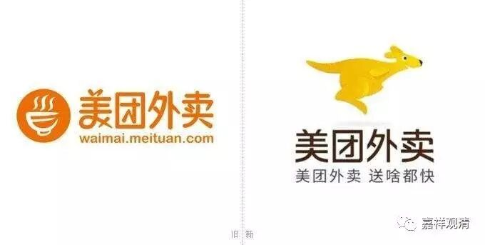

**《俱舍》与“美团”**

“美团”，大概是今天很多八零后、九零后的首选，我尚未和它发生过实质的交集。印象里，它是一个送餐饮的网站，百度了一下，原来是个团购网站，有口号是“团购一次，美一次”。大概现在主要做餐饮外卖服务吧。

偶然的，在《俱舍》里读到了“美团”。玄奘版《俱舍论》卷六：

** “……毘婆沙师说：生等相别有实物其理应成。所以者何？岂容多有设难者，故便弃所宗。非恐有鹿而不种麦，惧多蝇附不食美团。故于过难，应懃通释，于本宗义应顺修行。”**

这是说，有部在回应“生住异灭”的建立时，说：不能因为责难的人多就放弃了自己的观点！比如，不能因为鹿回来吃就不种庄稼了，不能因为有苍蝇叮就不吃美团了。所以呢，对别人的责难，自己要好好的想办法解释，守住自己的宗义。

这里的“美团”，看来是一种食物，真谛译本里做“果”，当是意译。检《根本说一切有部毗奈耶》卷23：

** “既见展已，持一美团授与令食。**

** 彼既食已，问言：‘气味何似？’**

** 答言：“圣者！此欢喜团极成美妙。”**

** 问言：“汝曾得此美好食耶？”**

** 答言：‘实未曾食。’”**

这里说，有个比丘拿美团给人吃，问：“怎么样？以前吃过这么好吃的东西不？”回答说：“非常好吃，从来没吃到过这么好吃的东西。”按此处的说法，这“美团”又名“欢喜团”，单单从这两个译名来看，“美团”就应该是印度的一种美食了。

《根本说一切有部毗奈耶》卷32又说：

** “若我邬波难陀常得乳粥及美团者，我亦常能教授……”**

这是邬波难陀说：“如果我也能常常得到乳粥和美团，我也能经常给你们讲课！”这里的意思，仍旧是说，“美团”应该是印度的一种很好吃的食品。

再引一则就打住。

《根本说一切有部毗奈耶杂事》卷5：

** “汝何所识？一、将盛饭，二、拟贮麨，三、用安饼，四、著美团，五、受羹菜，六、置乳酪，七、请助味。”**

三藏里提到“美团”的余处尚多，兹不广引。

美团网也许原先没想到，“美团”本身就是美食的意思。我看他们以后可以加这个意思进去。谁给我@一下他们，也许我们的图书馆就靠这篇文章了。

