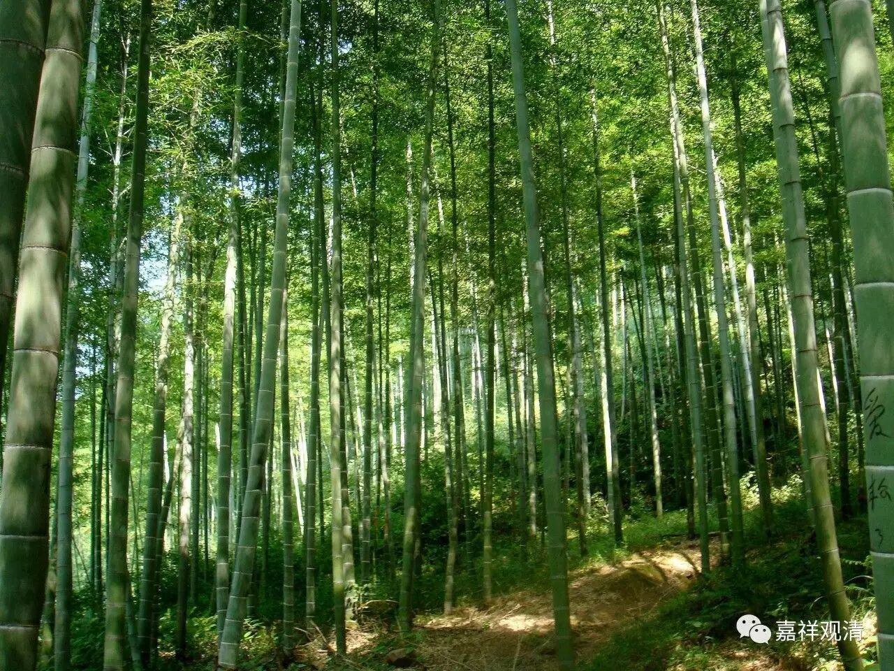

**金刚经 015（上）**

** **

好，我们继续讲《金刚经》。

上次讲到了“善男子、善女人”发菩提心的这一段，对发起菩提心稍微进行了解释。发起世俗的菩提心是在菩提心的七因果教授以后，在知母、念恩、报恩、慈、悲、增上心、菩提心生起以后，再生起任运的为利众生愿成佛的心，这就是世俗菩提心。再以后呢，和证悟空性的背景结合起来的，就是胜义菩提心。世俗菩提心，是我们讲的真正的菩提心。这一段当中的“善男子、善女人”，也是指的这个意思。

菩提心的生起，除了上面讲的“七因果”教授以外，还有一种“自他相唤”的菩提心教授，由阿底峡尊者辗转传来。后来又有把这两个合修的教授。这三种方法都指向世俗菩提心的生起。

昨天我看到有人在说：“有其他的注解里面讲，善男子、善女人是指受持五戒十善的人。”这是注解者没有对照看其他版本、论释的缘故啊！菩萨不一定是限于人道中的，六道都有菩萨，而五戒只有在人道当中才会有的，五戒是属于“别解脱戒”的，别解脱戒唯独限于人道。以其他版本和论释来看，这里的“善男子、善女人”很明显的是指的发起菩提心的众生。

我们接下去讲。** “复次，须菩提，菩萨于法，应无所住行于布施。所谓不住色布施，不住声、香、味、触、法布施。”**这一段是接着上面的，就是上面问菩萨“应云何住？应云何修”，这一段就是回答“应云何修”的。现在鸠摩罗什法师的版本当中没有这个“应云何修”，只有“云何降伏其心”，那这个就属于“云何降伏其心”了。

“色、声、香、味、触、法”大家都知道的吧？那么，什么叫“不住色布施”或者“不住于某某布施”呢？** “复次，须菩提，菩萨于法，应无所住行于布施。”**这个“不住”的背景是什么呢？以布施而言，这是指“三轮体空”，布施本身是“三轮体空”，不要住于它的谛实有。谛，就是二谛——“胜义谛”、“世俗谛”当中的“谛”。“谛”就是真实，“谛实有”就是究竟的存在。“色、声、香、味、触、法”是六境，可以说是布施的内容，这些，皆无实体。

我们继续往下看，应该如何“降伏”其心，或者如何“摄伏”其心。

