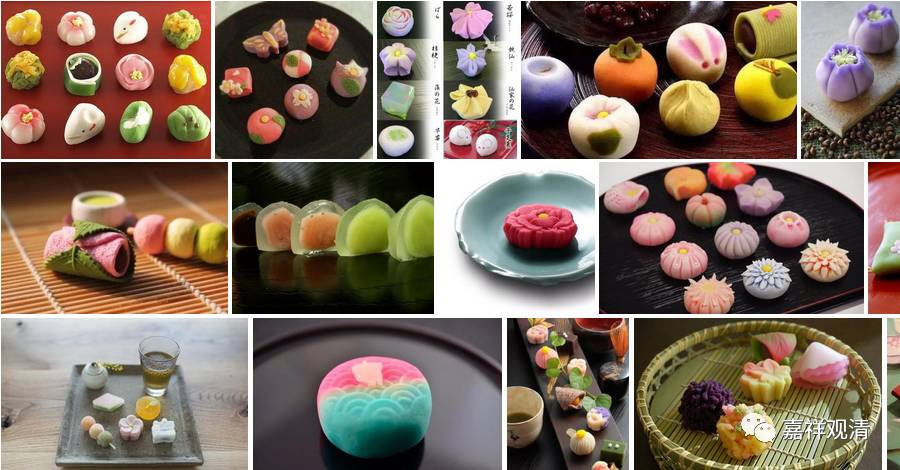

**
**

** 再说“美团”**

昨天的“美团”文，得到很多吃货支持（除了美团网）。我们接下来几天继续聊聊“美团”吧。

“美团”，又叫“欢喜团”，早期佛经记载是madhupindika，这个madhupindika，可以翻译作“甜蜜（美）饭球（团）”，《中阿含》里译作“蜜丸”。真谛法师译为“果”，《增一阿含》里译为“甘露”，这都是意思略近的意译。玄奘法师和义净法师则一致地译成“美团”。

“美团”、甜蜜饭球（madhupindika），在目前印度，对应的是这类食品：

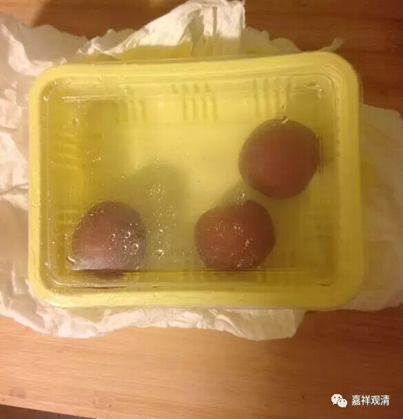

可以看出，这是一种印度甜食，它以香料、糖酥和面，炸好，本身就是一个甜球。或者放在蜜水或糖水里浸泡。

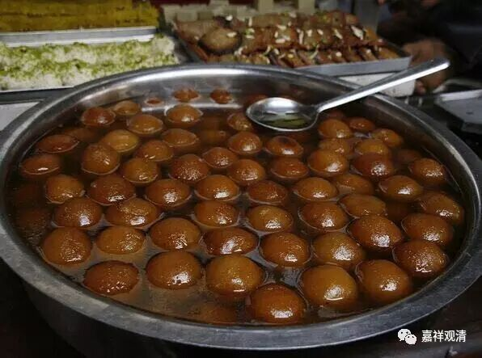

事部、行部的密法里也常见有“欢喜团”，是一种供品。印度人非常喜欢用这种甜食（其实是多种）堆积的小盆美食来供神，所以供神时，就是“食子”。

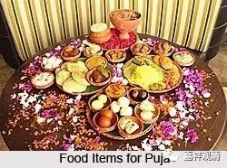

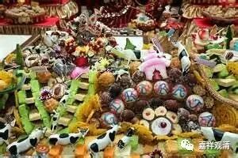

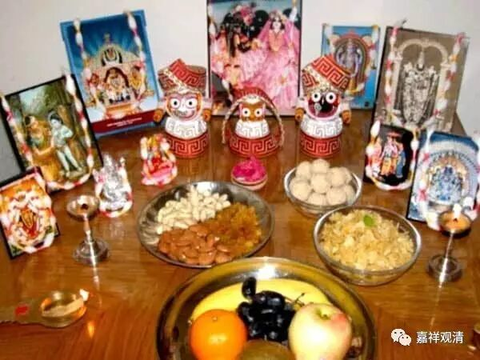

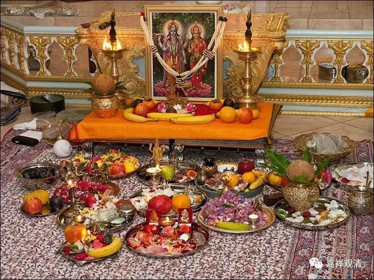

西藏因地制宜，用糌粑、酥油来做供品，是改造了的“食子”、“美团”。

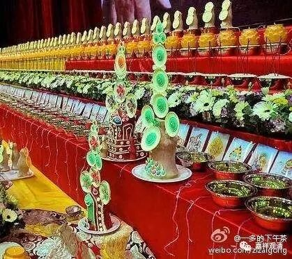

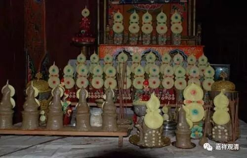

敦煌文献里有“食子”，并有出土的木制食子模具，类似现在的糕点模子。我在绍兴的老街上，见过这类模具的现实版，很有历史感。

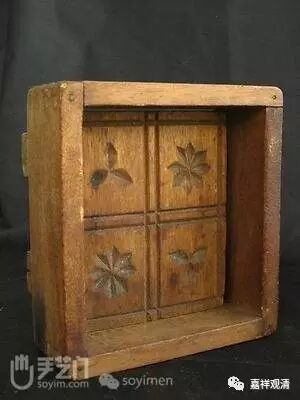

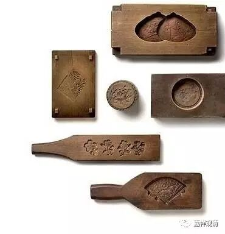

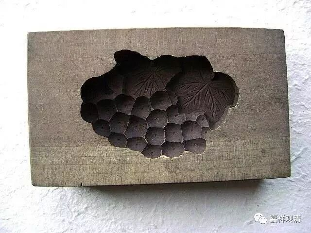

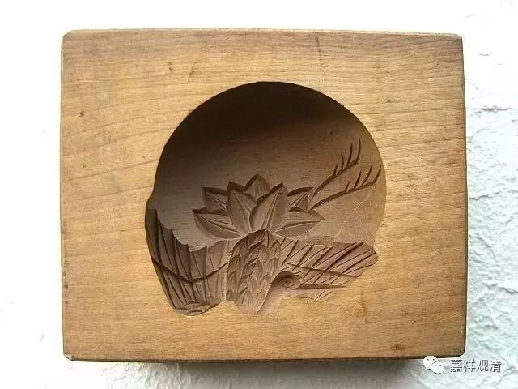

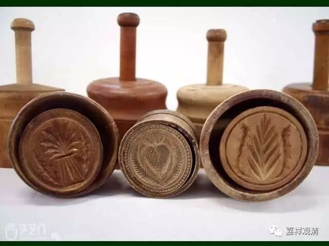

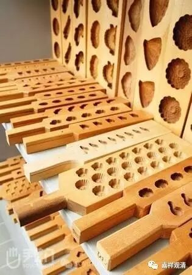

所以，大致可以认为，在唐代，大家普遍认同，“食子”就是糕点。“美团”是“食子”的一种，就是印度糕点。所以，我们的糕点，也可以叫“美团”。

日本的糕点，袭自江南，做得又很精致，真的可以对得起“美团”的称呼。糯米团、“和果子”是一休哥的最爱，我也被催眠了。估计大家也是。

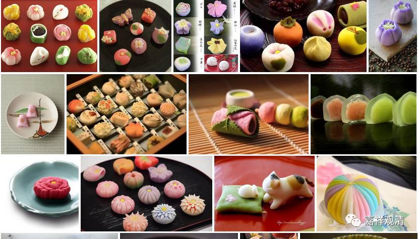

关于美团，还有后话，明天继续。

