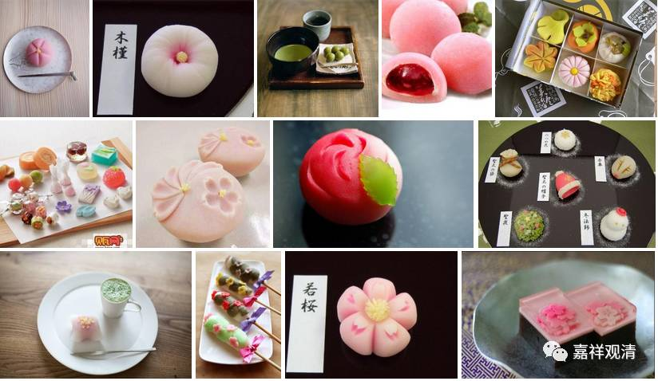
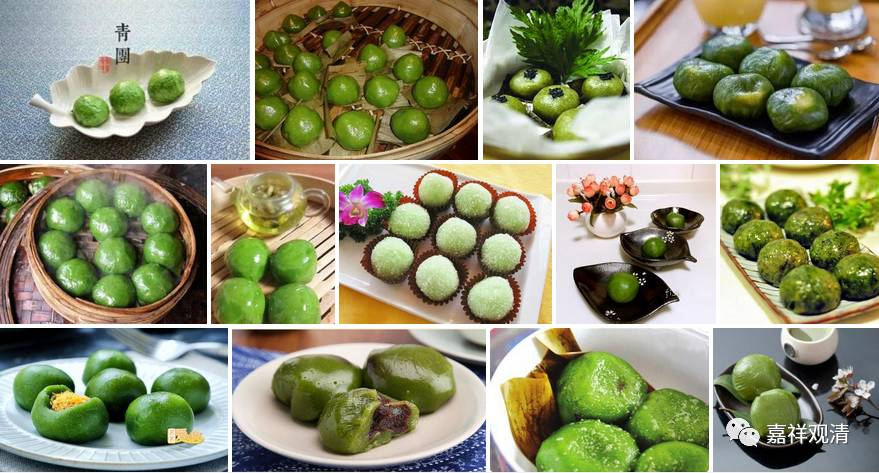

布施“美团”，得证罗汉

上两篇文说过，“美团”又叫“欢喜团”。《杂宝藏经》中有这样一则布施美团，四兄弟证果的故事：

**兄等……寻共来看，见弟福业踰于国王，便语弟言：“汝先贫穷，云何卒富？”**

** 答言：“我见瞿昙，施一鉢饭，得如是报。”**

** 四兄闻已，欢喜踊跃，又语弟言：“尔今为我，作欢喜团，我等四人，各持一团，供养瞿昙，愿求生天，不听其法，不用解脱。”**

** 于是各担欢喜团，往至佛所。**

** 大兄捉一团，著佛鉢中，佛言：“诸行无常。”**

** 第二复以欢喜团，著佛鉢中，佛作是语：“是生灭法。”**

** 第三复以欢喜之团，著佛鉢里，佛作是语：“生灭灭已。”**

** 第四复以欢喜之团，著佛鉢中，佛作是语：“寂灭为乐。”**

** 即还归家，至寂静处，共相问言：“汝闻何语？”**

** 第一兄言：“我闻诸行无常。”次者“复闻是生灭法”，又次者“闻生灭灭已”，第四者“闻寂灭为乐”。**

** 兄弟四人，各思此偈，得阿那含。皆来佛所，求为出家，得阿罗汉道。**

这是说有兄弟五人，最小的弟弟仅供佛一钵饭，竟富可敌国。其余兄弟四人说：“我们也去供养，但不求解脱不听课，供完就走，求生天界……”于是，各带“美团”，供养于佛。

次第供养，佛陀亦次第作言“诸行无常”、“是生灭法”、“生灭灭已”、“寂灭为乐”。

四兄弟回家说起布施美团时，各闻佛说了一句偈，仔细思维，竟同证三果！于是见佛、出家，得成罗汉！

看来以后要多用和果子供佛了。

哦，快清明了，可以供青团了。

