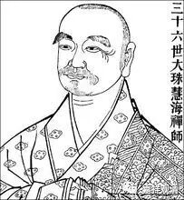

**金刚经 016（上）**

** **

好，我们继续《金刚经》。

前面讲到“云何修？云何降伏其心”的部分：** “须菩提，菩萨应如是布施，不住于相。”**如果按照鸠摩罗什法师的版本，这个“云何修”和“云何降伏其心”加在一起的话，就是前面的** “复次，须菩提，菩萨于法，应无所住行于布施。所谓不住色布施，不住声、香、味、触、法布施。须菩提，菩萨应如是布施，不住于相。”**这个“不住于相”是什么呢？是指不要有自性执。以布施为例的话，布施是由各种条件而产生的，所以它是自性空的，不要以为它有实体，不要住它是“实有的”这个相。这个“不住相”布施，不是“不要太认真”的意思，不是像我们通常所讲的“不要太执着”，根本不是。

接下去是一段比喻：** “何以故？”**为什么呢？** “若菩萨不住相布施，其福德不可思量。”**如果菩萨布施的时候，能够通达和“空”相应的教法，能够理解到它是缘起性空的，能够证到它的缘起，** “其福德不可思量”**，这个福德呢，非常非常大，不可思量，不是我们的算术、比喻、思维所能及的。

这并不是说我们平时所行的布施没有福德或者福德少，如果以菩提心来布施的话，布施的功德也是非常非常大的。但是在同样有菩提心的背景下，如果再持空正见去行布施的话，这个布施的福德不可思量。没有空性见的行为和有空性见的行为比起来，那一定是有空性见的福德要大，而且要大得多。那么同样地，如果有空性见的情况也是一样，有菩提心的功德比没有菩提心的功德要大得多。

前面已经讲过了，发起菩提心的人在出定以后仍然能够生起和“空”相应的智慧，在胜义菩提心的背景下去行布施，那么他的福德是不可思量的。同样地，他所行的持戒、忍辱、精进、禅定这些所相应的功德，也是一样的不可思量。六波罗蜜多也好，十波罗蜜多也好，都是如此。这里只取一个布施来讲，是举个例子，其它的也是一样的。

在其他经典当中我们也会看到，当布施有了智慧的引导，有了空性见的引导，就可以称为“布施波罗蜜”了，否则它只能称“布施”而不是“波罗蜜”。这在前面已经讲过，因为已经有了菩提心的背景。

在禅宗里面有这样一个故事，好像是大珠慧海禅师，他闭关的地方好像在宁波附近。有人去问他：“什么叫布施？什么叫布施波罗蜜？”大珠慧海禅师回答说：“于布施而离烦恼就是布施波罗蜜。”很有道理！“于布施”，这是指世俗谛的布施，“离烦恼”，在这里是指与“空”相应的慧，它能够通达、能够实践、能够证悟一切法的缘起性空。与此相应的布施就称为布施波罗蜜多，所以在这里的布施也可以是指布施波罗蜜多。

