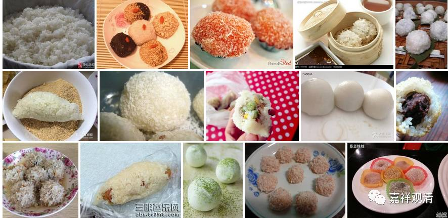
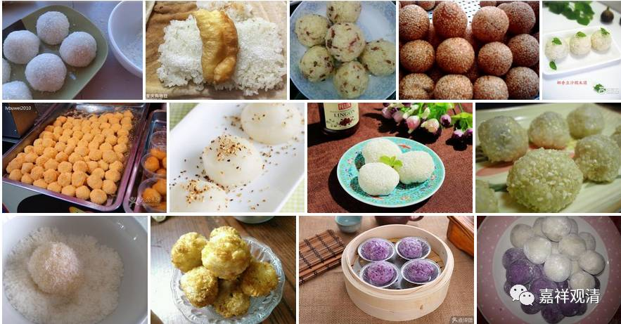

“美团”送来最初的沙弥

“美团”第三弹：美团送来最初的沙弥——罗睺罗。

《法华玄赞要集》：

**“耶输陀罗（释迦太子之妻）以欢喜团一枝，置罗睺罗手中把著：“交觅汝父献与。”**

** 时罗睺罗年始六岁，巡诸比丘，到世尊前。头便顶礼。而说偈言：“如是如是，沙门沙门，萨凉萨凉，快哉快哉！”**

** 尔时世尊……罗睺随佛出宫门外，佛授手指及履，与令执捉，如绳繫马，不相捨离。**

** 至尼拘林，世尊问言：“汝随我出家否？”**

** 答云：“能。”**

** 令舍利弗为和上。**

** 从此始有沙弥……”**

这里说：

释迦佛带领一众弟子回到迦毗罗卫国……昔日太子妃耶稣陀罗把孩子罗睺罗叫来。给了一枚欢喜团（美团），说：“给你爹送去！”

孩子（罗睺罗）当时才六岁，跟着出家人来到释迦佛身边。他给世尊献上美团，非常高兴，还唱了首诗（终于见到爹了！）

……释迦佛牵他出宫，来到城外林间，问罗睺罗：“你跟我出家怎么样？”

罗睺罗答应说：“行！”

世尊就让罗睺罗以舍利弗为和尚，剃度出家……

僧团里这就有了最初的沙弥……

（耶输陀罗一块点心，把孩子给送出家了……罗睺罗后来也成了罗汉，十大弟子中，称为“密行第一”。）

一块点心送出一个罗汉。

