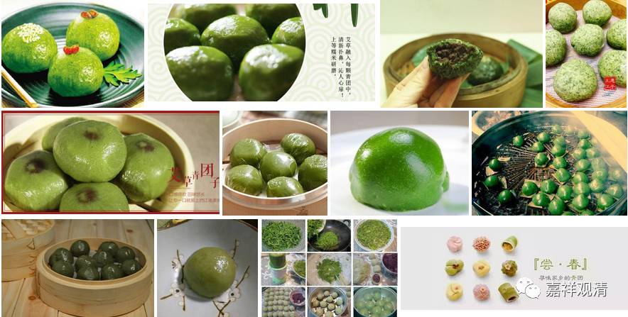

完败的“美食诱惑”

《根本说一切有部毗奈耶破僧事》卷十二：

***尔时世尊知诸女等性力意愿，以四谛理广为分别。诸女闻已得预流果，唯耶输陀罗，为染心重故，未获于果，便作如是心念口言：“我有滋味，能令喫者心生爱著”即作种种馨香美味诸饮食等，自手执持而奉世尊。作是念已……***

***诸苾刍皆闻以报世尊，佛言：“诸苾刍当知！我昔三毒未离之时，诸有香味而无爱著。何况今者三毒已离，而能染我？耶输陀罗纵有食味，我无所惧。”***

这段故事应该是昨天“罗云出家”的前奏。

话说释迦佛带领一众弟子回到故乡迦毗罗卫国……

一次，为诸女众说法。闻法之后，很多人都证得最初的圣位——初果，但是太子妃耶输陀罗“染心重故，未获于果”。估计虽在现场，就完全没听进去，心里还在想着：“我做饭做得好，吃了我做的食物（欢喜团），就会回心转意！”于是动手做美味饮食——欢喜团、美团，欲动无上道人心。

不知咋的，走漏了风声。和尚们知道了，给佛陀打了小报告：“那谁谁谁，要如何如何……”。

佛陀说：“当年有贪嗔痴的时候我都能舍弃美食，今天三毒已断，纵有美味，又怎么会令我染着呢？”是啊，当年还是太子，都能放弃富二代+王二代的“幸福生活”，离爱出家，今已究竟断障，怎么还会被美食所诱呢？呵呵，关键是，家人不信啊！

一顿美食，对阿罗汉、佛陀来说，多大点事儿嘛！（说起来，佛爷啥没见过？）

后面就接上昨天的故事了——耶输陀罗做完美团，让罗云小朋友把欢喜团（美团）给佛陀送去（美食+亲情）……结果呢，机关算尽，本欲唤回瞿昙，竟至赔上了孩子，那是急得要跳楼啊（老佛爷这招叫“釜底抽薪”）……

不过后来呢，耶输陀罗也出家了，最终证得阿罗汉果。此是后话，暂且不表。

