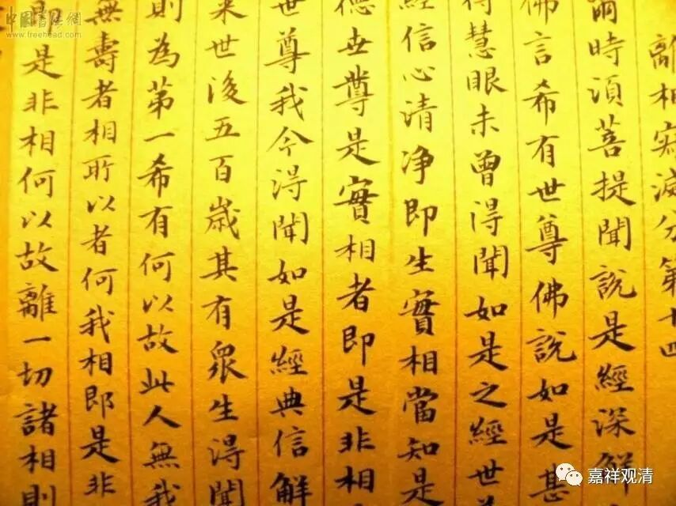

**金刚经 017（上）**

** **

好，我们继续讲《金刚经》。

《金刚经》最前面的一段，称为“序分”。就像我们在小学里学写的作文一样，文章的开始要先交代时间、地点、人物、事件等等，这些都有了。接下去呢，称为叫“正宗分”，就是主要所讲的内容。在“正宗分”当中，我们已经讲到了** “若菩萨不住相布施，其福德不可思量……菩萨但应如所教住”**这一段，也就是“正宗分”最前面的第一段已经讲完了。

而这一段可以说是整部《金刚经》最重要的部分。它在讲什么呢？它在讲发起菩提心的菩萨在证得胜义菩提心以后，在证得空性以后，他所行持的六度——布施、持戒、忍辱、精进、禅定、智慧，都是要以与空相应的智慧来摄持的。这样就是地上菩萨的行为，** “应如是住，如是降伏其心”**，应该是这么去做的。

那么，这不是泛泛地对一般的人，而是对于胜义菩萨而言的。其实经文当中说的** “即非菩萨”**的菩萨是指胜义菩萨，也就是为大家指出了这些生起胜义菩提心的菩萨是这样实践的：他们在发起菩提心以后，不仅有菩提心的摄持，还要有空性见的摄持，那他们所做的六度等行为的福德就不可思量，也证实他们的所作和地前的菩萨是完全不一样的。地前的菩萨呢，是有菩提心的，但是没有完全现证空正见——这个是指一向的菩萨，就是一开始就是大乘的菩萨，不包括“回小向大”的菩萨，“回小向大”的菩萨另外再说。

《金刚经》最前面的这一段呢，基本上可以说是它的核心部分。那么，后面在讲什么呢？（很多人就是这样顺着讲下去的。）我们之前说过，《大藏经》里有好几部解释《金刚经》的论典，在印度来讲比较重要的可以说就是弥勒菩萨的颂文、世亲菩萨的解释和无著菩萨的解释。我们现在就主要按照世亲菩萨的解释来讲，世亲菩萨也是顺着弥勒菩萨的说法解释的，他把这后面的内容分成二十七个问题。这二十七个问题，可以说把《金刚经》的内容分得非常清楚，所以我们就没有用昭明太子的分类方法。世亲菩萨的这个分法真是非常非常地好，以我们的学识和能力，真的是看不出来这样的归纳。但是，一般世面上很多对《金刚经》的讲解基本上都没有用过这三部论。

其实，还有一部比较重要的对《金刚经》的解释是《金刚仙论》。如果我没有记错的话，这是菩提流支论师的译作。有说是他本人著作的，也有说是他翻译的，我比较倾向于是他翻译的。《金刚仙论》好像是从他的老师那里传承下来的，大家有兴趣的话可以去看一下这部论典。（我们也可以看看，是不是可以印这部论典。）现在大部分人是不看、不印这些论典的，玄奘法师和义净法师翻译的《金刚经》大家已经看得很少了，而最正统的对《金刚经》的解释，大家更是不看。很可惜哦！有机会的话，大家真的应该看一看。我们也可以组织印一下。

