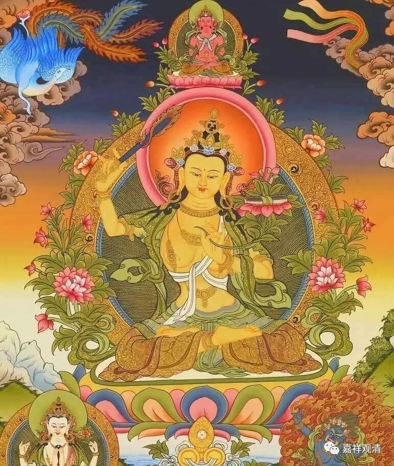

终于明白为什么说有“阐提种姓”的存在了！

佛教有“种姓说”，这很多人都知道。其中，以瑜伽行派谈的比较多，大致上，瑜伽行派的主流非常认同并严守种姓说。比如护法——戒贤——玄奘系的唯识师就在五种性的问题上很固执地坚持。

四种姓，是在《般若经》里点过名的，就是所谓菩萨种性、缘觉种姓、声闻种姓、不定种姓；再加上一个没种姓的——阐提种姓。全算上，就要算五种性，实际就四个，最后一个，只有种姓的名字而已。（这像极了印度的种姓制度——四种姓+贱民。）

这里的“种姓”呢，并不如印度的阶层分化制度那样，而是指有没有“涅槃的种子”、有没有“堪能解脱”的未来。其中，“菩萨种性”，就是指有“成佛的种子”，注定会成佛的；“缘觉种姓”和“声闻种姓”，也就是注定会成缘觉阿罗汉和声闻阿罗汉。“不定种姓”，就是可塑性很强，遇到谁，就跟谁走，但总之，一定能解脱，看遇到什么样的人带，最后，或者能成缘觉阿罗汉，又或者成声闻阿罗汉，运气好点遇到大乘善知识，就成佛。

“阐提种姓”则不同，他是从来就没有解脱之因的，自始自终没有解脱的可能。这怎么理解呢？《瑜伽师地论》里说：这样的人有很多特征，但都不具备解脱方面任何一点点的善根——或者怎么都不信、或者营营于轮回……总之，随你怎么诱导也生不起丝毫的出离之心。

……

就中国大部分佛教徒而言，大都知道“一切众生皆可成佛”，所以“种姓说”很少有人接受，即便如玄奘法师，对接受这种观点，也是经历了种种挣扎，最后在戒贤大师痛责之下才选择了“我爱我师”。我在学习唯识的时候，也觉得很难理解，如果就现实层面我觉得很容易接受，但如果说这是究竟的“一向说”，则依旧找不到思路，于是照旧遭到唐老的“痛责”。（我曾经想到过一个很好的解答，可惜，自己把答案忘了。真是……）

最近，这个困扰我近二十年的问题，我（通过现实）找到了答案！啧啧，瑜伽行派的大师们真的了不起！

如果大师们宣称“一切众生皆有佛性”，那就真的得和罗家英一样“循循善诱”、对谁都“矢志不渝”！不然就要被轰“不慈悲”、“不大乘”、“不平等”！而如果选择了“有一类人是打死也没有解脱因缘的”，承认有这种“阐提种姓”的存在，那就可以对一类无脑信徒轻轻舍置，淡淡地来一句“若无种姓，学法无益！阿弥陀佛！善哉善哉……”

究竟层面，非我所知，现实地来说，真是教育资源利用最大化的一种学说啊！——不必浪费精力啦。

愿一切有情皆具解脱之因，速臻彼岸！

