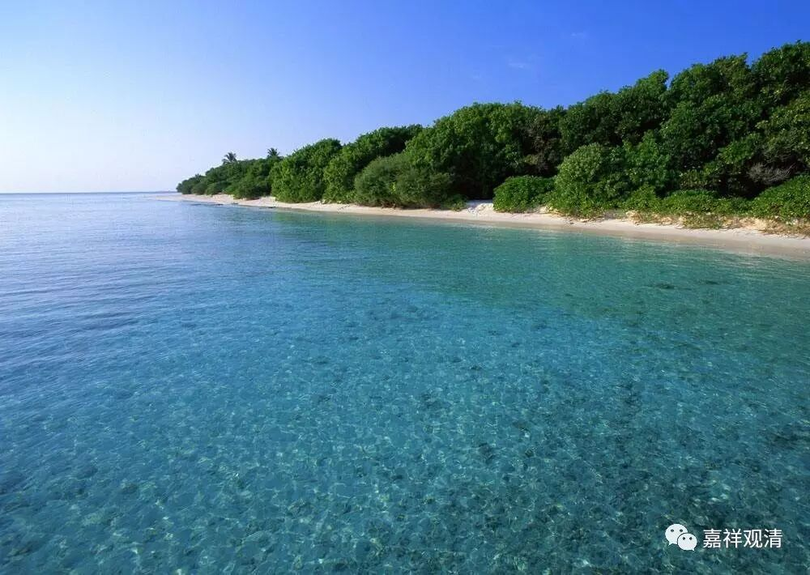

**大众部之四生说**

** （三）舍置答与分别说**

大众部计“有苦是自所做”、“是他所作”、“是两所做”、“不依因缘生”的提出，或直接源自此部对《阿含经》的解释。

如《大毗婆沙论》卷199引无衣迦叶因缘：

** 谓无衣迦叶波因缘是此见等起。彼无衣迦叶波昔在家时曾为商主。数入海採宝。**

** 最初入时逢诸海难，辛苦得出，便作是念：“此难苦者，是我自作——坐入海时不洗浴故。”**

** 彼于第二入时，便自洗浴。既入海已，遇难如前，辛苦得还。复作是念：“此难苦者，是他所作——坐入海时不祠天故。”**

** 彼于第三入时，便自洗浴，及亦祠天，既至海中，如前遇难，困而得免。便作是念：“如是艰苦自作、他作——坐入海时洗浴、祠天不殷重故。”**

** 彼于最后便极殷重洗浴、祠天，然后入海。入已遇难亦复如前，仅得迴还。便作是念：“此所遭苦，不由自他，但无因得。”**

** 彼由此故，便见居家摄受过失，即往无衣外道法中出家。后于王舍城见佛，便问：“苦由谁作？”**

** 尔时世尊以四记论法而调伏之，广说如《无衣迦叶波经》。**

** 故彼因缘，是此见等起。**

裸行外道迦叶曾为商主，四次入海贸易而四次遭遇海难，他对自己四次海难的原因先后总结为“自作”、“他作”、“共作”、“无因”（其最后之“无因作”，是对前三的否定。）。最后不能解释遭逢海难的因果，于耆那教里出家。后得见佛，以此事相询。佛则以“** 四记论法而调伏之**”。

** “四记论法”**，即：1、一向；2、分别；3、反诘；4、舍置。这里，佛陀对裸行迦叶，用的是“舍置记”，就是不予记说，彼如针对“十四无记”之类的问题，佛便用了“舍置记”——不予正面回答。

此处，佛没有给予回答，但大众部显然是针对此经，而给予了“分别”的回答：有自生的（暗含有非自生的）、有他生的（非他生的）、有共生的（非共生的）、有从因生的、有无因生的。——佛陀的“舍置（无）记”，大众部给予了“分别说”。

