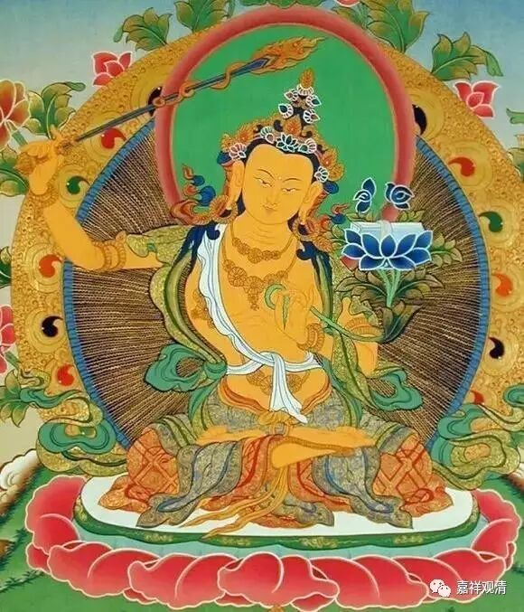
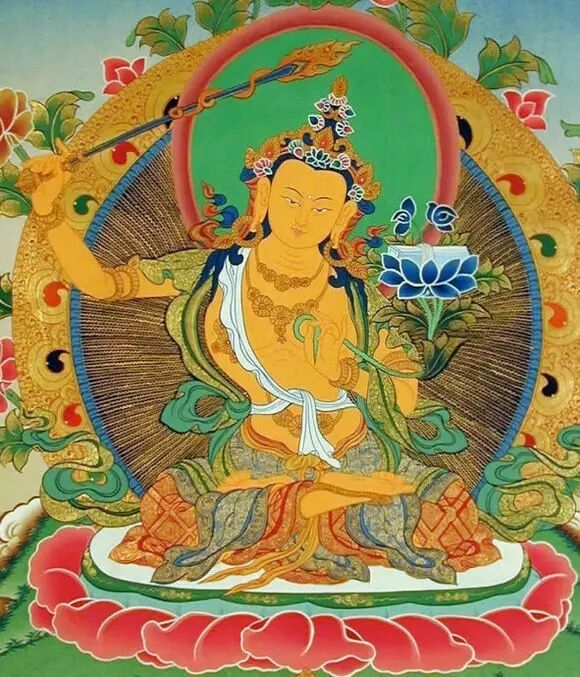

根据师长口授，此法无需特别灌顶，但需修行者本身**具有黄文殊灌顶且获得此法口传** 。

 行者于每日起床后，在未讲话、未洗漱、未饮食前修习此法，修满一年即有体验。但修习此法者若不识所诵文字，自然不可能有所成就。即，若某人虽然快念成就，但其不识汉字，则该法无法在其试图读诵汉文典籍时发挥功效。

 我曾亲见修习此法有效之师长读诵经文，我个人在常人中大约当属读诵较快之辈，然彼较我迅速十倍以上。

**
**

** 快念教授**

** ——“速疾成就读诵及舌”体验成就法**

帕绷喀 德钦宁波 著

江央益西 译

礼敬上师及至尊文殊！

欲修习甚深快念教授，清晨说话前，在语加持后，先以三遍“诸佛正法贤圣三宝尊……”略修皈依发心，然后：

嗡 索巴瓦须达 沙尔瓦 达尔马 索巴瓦须多吽。转成空性。

观想：从空性状态中，刹那间榜字转成莲花、阿字转成月垫，其上自心转成红黄色“滴”字，自身至尊文殊阿日阿巴杂那，身色红黄，一面二臂。右手将火焰炽燃之智慧剑举在空中，左手以拇指、食指当胸持乌巴拉花茎，花瓣在耳畔盛开，上有智慧经函。足金刚跏趺坐。具十六岁童子相，发具五髻，相好庄严，宝饰天衣，额间标以嗡字、喉间标以阿字、心间标以吽字。自舌转成双刃剑，尖端锋利，向上竖立，具光之自性，（舌）根部标以滴字，周围“嗡阿日阿巴杂那”咒轮围绕。

在清晰缘念的状态中，不急燥不间断地念诵千遍“嗡阿日阿巴杂那滴”。

最后，观想剑、滴字、咒轮化光，融入舌中，舌成金刚自性。

如是，若每日清晨不间断修习，只用一年，就会出现读诵非常迅速的极上特征，另外也会体验到舌头灵巧、语不颠倒，对口吃也有好处。此是出自《文殊法类》根本文“若求语美善，主要生于舌”、“语之事业欲速疾，观察一切舌上生”之教授。此教典，由赤金祖古之经师赐予赤金祖古，我帕绷喀祖古在最尊贵的金刚持面前获得。

 

附：

根据以上帕绷喀仁波切教授，完整的“快念成就法”仪轨如下：

前行：

诸佛正法贤圣三宝尊  从今直至菩提永皈依

我以所修施等诸资粮  为利有情故愿大觉成（三遍）

自观金刚萨埵尊，舌心阿字化为满月轮，其上如水涌泡般涌现白色嗡字，彼外前右绕一周白色元音咒字轮，为：嗡 阿啊 伊伊 乌乌 日日 利利 诶诶 哦哦 昂阿 娑哈。其外红色子音咒左绕一周，为：嗡 噶喀嘎嘎盎 匝擦杂杂尼雅  扎插闸闸那 答塔达达纳 巴怕拔拔嘛 雅惹拉瓦 夏卡萨哈恰 娑哈。其外复有缘起咒蓝色右绕一周：嗡 耶达尔嘛 嘿度巴尔巴瓦  嘿敦迭 肯达塔嘎多 哈雅瓦度达  迭喀佳犹尼若达 埃旺巴迪 嘛哈夏尔嘛纳耶娑哈。此三咒轮光明莹澈，自性观毕。

嗡 阿啊 伊伊 乌乌 日日 利利  诶诶 哦哦  昂阿  娑哈（三或七遍）

嗡 噶喀嘎嘎盎 匝擦杂杂尼雅 扎插闸闸那 答塔达达纳 巴怕拔拔嘛 雅惹拉瓦 夏卡萨哈恰 娑哈（三或七遍）

    嗡 耶达尔嘛 嘿度巴尔巴瓦 嘿敦迭 肯达塔嘎多 哈雅瓦度达 迭喀佳犹尼 若达 埃旺巴迪 嘛哈夏尔嘛纳耶娑哈（三或七遍）

观：

三咒轮与嗡字发光，召请十方一切佛菩萨及密咒加持力等，以嗡字和三咒各自之形象，融入舌心各咒轮及嗡字中；复以光明勾摄世出世间一切资财，以轮王七珍、吉祥八宝等形象，融入嗡字及咒轮中；复又勾摄一切已成就真言行者，及已证得相应行者，所有一切语加持力，化为嗡字及三咒，入于咒轮及嗡字中。由此深信定解一切加持力合成一味。最后观嗡字发光，照触三咒，彼等由外向内次第化为光明甘露，融入嗡字中。嗡字亦化光明甘露，融入月轮。月轮化光，变为白色啊字。啊字复化为红白光明甘露，融入自舌。舌成金刚杵之自性，一切佛菩萨真言成就神通悉地及持明仙等一切语加持力入于舌中。圆满具备一切语加持力矣。

正行：

嗡 索巴瓦须达 沙尔瓦 达尔马 索巴瓦须多吽。转成空性。

观想：从空性状态中，刹那间榜字转成莲花、阿字转成月垫，其上自心转成红黄色“滴”字，自身至尊文殊阿日阿巴杂那，身色红黄，一面二臂。右手将火焰炽燃之智慧剑举在空中，左手以拇指、食指当胸持乌巴拉花茎，花瓣在耳畔盛开，上有智慧经函。足金刚跏趺坐。具十六岁童子相，发具五髻，相好庄严，宝饰天衣，额间标以嗡字、喉间标以阿字、心间标以吽字。自舌转成双刃剑，尖端锋利，向上竖立，具光之自性，（舌）根部标以滴字，周围“嗡阿日阿巴杂那”咒轮围绕。

在清晰缘念的状态中，不急燥不间断地念诵千遍“嗡阿日阿巴杂那滴”。

结行：

最后，观剑、滴字、咒轮化光，融入舌中，舌成金刚自性。

回向：

法王宗喀巴，圣教日兴隆。违缘俱消灭，顺缘悉增长。自他三世善，回向二资粮。无垢亦无染，法炬长明耀！

