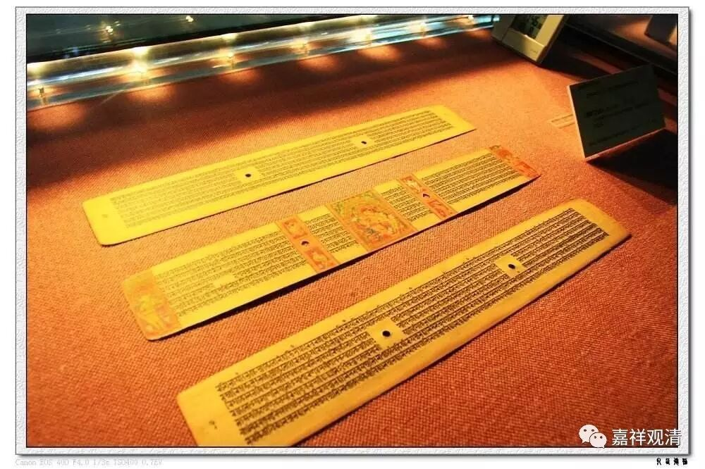

**《金刚经》022（中）**

好，从上面接下来的问题就出现了。既然不能说佛有三十二相、八十种好——也就是佛的色身，那么真正来说，佛是从佛的无为性而表现的，从佛的真如或者胜义或者究竟的真理上来讨论的，是无为法所显的。有为法都是色身、表相、因果层面的东西——中观一般都是这么讲的。如果是这样的话，那这么深的法、这么难得的法，释迦牟尼佛为什么要讲呢？这么难得的法，这么高深的法，又是无为法所显的，这种无为法你怎么用有为法来表现呢？然后又怎么去讲呢？或者说，既然最究竟的是无为法，那还有这些法可说吗？

前面在说** “法尚应舍，何况非法”**，既然** “法尚应舍，何况非法”**，那要不要讲法呢？无为的因感得无相的果。那么佛陀成道了，不也是无相吗？他如果讲法的话，那不就变成有相了吗？如果是无相的话，那何必讲呢？

顺下来的意思是一样，回答的背景也是一样。法身本身当然是无相、无说，然而就世俗的色身而言，就有诸佛的开示，也有诸佛的八相成道——降兜率、入胎、出胎、出家、降魔、成道、说法、涅槃，这些都是有的。在胜义谛上，法身无得亦无说。《心经》里面也是一样，“无智亦无得”，整个地从色法乃至究竟的一切种智，凡是佛说的法，胜义当中都不可得。

我们来看《金刚经》的文字：** “须菩提，于意云何，如来得阿耨多罗三藐三菩提耶？如来有所说法耶？”**佛发起的问话：“须菩提啊！我问你，如来得阿耨多罗三藐三菩提吗？如来有所说法吗？”** “须菩提言：‘如我解佛所说义，”**如果我知道佛的意思的话，** “无有定法，名阿耨多罗三藐三菩提。亦无有定法，如来可说。”**

**
**

这里面的“定法”一定要小心哦。这个“定法”，我们现在总是把它理解为“一定”，把** “亦无有定法”**理解为“不是有一定的法”等等，所以大家会觉得：“哎呀，不要太认真了！”但这里的“定”，不是一定的“定”，用我们今天的翻译该怎么讲呢？就是实有的意思。“阿耨多罗三藐三菩提”是不是实有呢？如来说的法是不是实有呢？“阿耨多罗三藐三菩提”也好，如来所说的法也好，都非实有，它非谛实有。

