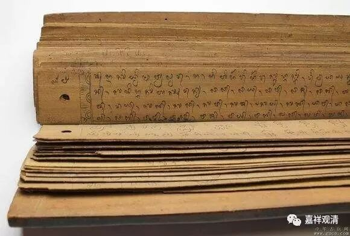

聊聊“印证”——关于“他令入”

大天五事：“余所诱无知，犹豫他令入，道因声故起，是名真佛教。”这是大众部系统与上座部系统最初分化的源头。上座部系统视大天为造无间业者，而大众部系统《分德功德论》里，却说“唯大天一人是大士，其余皆是小节”。

“大天五事”中第四，为“他令入”和我们常说的“印证”相当，意思是：证果的圣者，有些需要别人来应证，非唯凭自证知。

据《异部宗轮论述记》记载：

后彼弟子披读诸经，说阿罗汉有圣慧眼，于自解脱，能自证知，因白师言：“我等若是阿罗汉者，应自证知，如何但由师之令入，都无现智，能自证知？”彼即答言：“有阿罗汉但由他入，不能自知。如舍利子智慧第一，大目键连神通第一，佛若未记，彼不自知。况汝钝根，不由他人而能自了？故汝于此，不应穷诘。”

大天弟子们问：“我们看书，说阿罗汉应有慧眼，应该知道自己证得果位。为什么我们证阿罗汉果，需要师父来印证而不自证知呢？”

大天回答：“有的阿罗汉不能自己了解自己证果，需要他人来印证。比如舍利弗智慧第一、目键连神通第一，尚需佛陀印证。何况你们这些钝根，不由别人印证，怎么能够自己知道呢？”

这两天也碰到一件事情，也许可以为此（“他令入”、印证）做一个比喻。一个地理知识不够的游客，坐高铁从上海到南京，要乘务人员告知才确定“到南京了”。这便类似于“他令入”者，自虽证果，而需他人印证。若此游客地理知识丰富，或有相关知识见闻，便自知已到某处某处，不必须“他”来印证——这就是学修具美的利根行者了。

因论生论：

关于“他令入”的“他”，也就是“给予印证者”，一般指向是“过来人”即已证此果者，但极端的似乎还可以有这种情况：已到目的地的人，由未到过的知识丰富者来“印证”——比如到某地以后打电话询问朋友，此朋友虽从来没有来过此地，但以其丰富的知识、经验来分析，确定“你已到了某处”。这种情况似乎也可以存在。（类似，部分证果者可以由知识丰富的法师来印证。所以佛教预言，最后的法师和罗汉离世，佛教灭亡。法师和罗汉在佛教传播上地位同等重要。）

这个，可以继续讨论。

