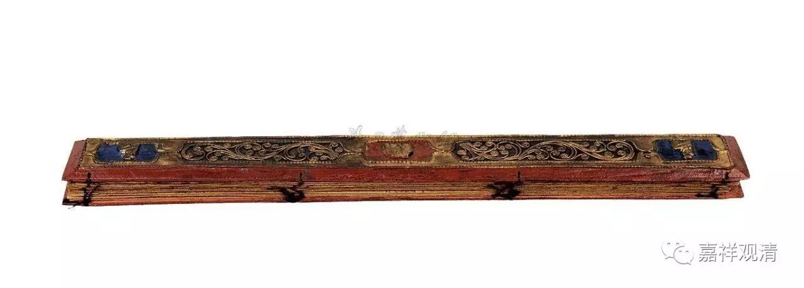

**《金刚经》022（下）**

** “何以故？如来所说法，皆不可取，不可说，非法，非非法。”**如来所讲的这些——如来讲的就是佛经嘛——都非实有。实有的东西是找不到的，** “不可取，不可说，”**不是实有的、可说的。** “非法，非非法。”**

** **

** “所以者何？一切贤圣，皆以无为法而有差别。”**在其他版本当中是怎么翻译的呢？我们来看一下玄奘法师的翻译：** “佛复告具寿善现言：‘善现，于汝意云何，颇有少法，如来、应、正等觉证得阿耨多罗三藐三菩提耶？颇有少法，如来、应、正等觉是所说耶？’善现答言：‘世尊，如我解佛所说义者，无有少法，如来、应、正等觉证得阿耨多罗三藐三菩提，亦无有少法，是如来、应、正等觉所说。’”**

** **

早期翻译的“定法”，在这里被翻译成“少法”。少，念shǎo（第三声），没有一点点的意思。这个是什么呢？实法，没有一点点的自性。如来，我们知道是指如真理而来。应就是应供。正等觉，就是正遍知。佛陀所证的、所说的都无有实法可得。

** “何以故？世尊，如来、应、正等觉所证、所说、所思惟法，皆不可取，不可宣说，非法，非非法。何以故？以诸贤圣补特伽罗皆是无为之所显故。”**

** **

前面鸠摩罗什法师版本中的“以无为法而有差别”的差别，就是显现的意思。有一种错误的理解，认为是在无为法上显示差别，其实在无为上是显不出差别的。无为法、你的无为法、我们的无为法、佛的无为法、空，都是一样的，但是它们的所依是有差别的。如果一定要说我们所认为的差别，那就是在有为法上的差别。

** “以诸贤圣补特伽罗皆是无为之所显故”，**是什么意思呢？我们现在讲的鸠摩罗什法师的版本中是：** “一切贤圣，皆以无为法而有差别。”**一切贤圣都是证得无为法，所以叫他们贤圣，叫他们圣者。佛呢，也是证得无为法的，佛说的呢，也是无为法，佛的所证和所说呢，也都要契合于这个究竟的真理——自性的空。那么，一切贤圣也是证得自性的空的，一切贤圣也是证得无为法的。如果一定要说差别的，那差别是表现在有为法上。一切贤圣都是在无为法上的表现，表现为什么呢？表现为各个不同的圣贤等等。

这些内容我反复地讲，是因为我们通常被以前一些道家化的文字而误导了。比如说，“定法”的定，我们都理解为一定，实际上它是指实有，我们现在想过来这是完全正确的。这个“定”是实有的意思。然后，** “一切贤圣，皆以无为法而有差别。”**这个差别是显现的意思，也可以这样翻译的。是什么意思呢？一切贤圣也好，一切圣贤也好，都是证得无为法，然后在无为法上面而显现出初果、二果、三果、四果。但是初果、二果、三果、四果这些不是无为法本身的显现，而是有为法的显现。

好，今天先到这里，接下去还会继续讲，谢谢大家！