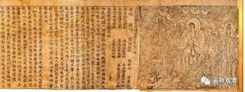

**《金刚经》023（上）**

好，我们继续《金刚经》。

上次讲到哪儿了我有点忘了，反正讲的也不多，我们先来看吧。比如说** “所有一切众生之类……”**这里肯定是讲完了，这是指所有一切的众生都要度，都要利益。利益的背景就是** “……令入无余涅槃而灭度之”**，这里的无余涅槃其实是指向佛的“无住涅槃”的，就是把一切众生引导向究竟的佛陀的果位。

还有** “无我相、人相、众生相、寿者相”**应该也已经谈到过了，实际上“我、人、众生、寿者”之间并不是一个递进的关系，而是并列的关系，包括摩那婆、阿特曼等等，也是并列关系。在另外一个版本当中是八个并列的，是同一个意思，都是无我相的意思。有汉人解释错了，某些藏人现在也按照错误的来解释了。其实** “**我、人、众生、寿者”只是不同的词，指向的意思是一样的，是并列的，并没有递进的关系。某某堪布在讲课的时候说这个是递进关系，应该是看到了一些汉地的书吧。

关于四方的虚空不可思量，它的意思有两方面。一方面代表多，东南西北方的虚空不可思量，比喻，菩萨布施的功德假如有数量的话也是不可思量，很多很多。另一方面，有一种教授说，这一段也可以用来配合观修的。

接下来，“无相之因，云何感得有相之果？”前两天正好有一个人也在问这个问题，对应哪一段呢？就是这一段：** “‘须菩提，于意云何，可以身相见如来不？’‘不也，世尊，不可以身相得见如来。何以故？如来所说身相，即非身相。’佛告须菩提：‘凡所有相，皆是虚妄，若见诸相非相，则见如来。’”**

** **

这一段的意思是，前面讲完了以后，明明讲的是诸法空相，那为什么空相的因或者诸法无自性的因，感得的果却是有相的呢？这是对方的一个问题，或者说是我们的问题，是须菩提替我们来问出这个问题。为什么呢？成佛以后，佛就有三十二相、八十种好，这个是佛才有的身相。其中的三十二相部分，转轮圣王也是有的（但是也说只有佛才具备这个圆满的相好）。于是对方就问：既然最后证得的是无余涅槃，是需要依靠般若智慧来证得，此智慧通达诸法无自相，那么以无相的因——般若之智，为什么会感得成佛以后三十二相、八十种好的有相之果呢？

