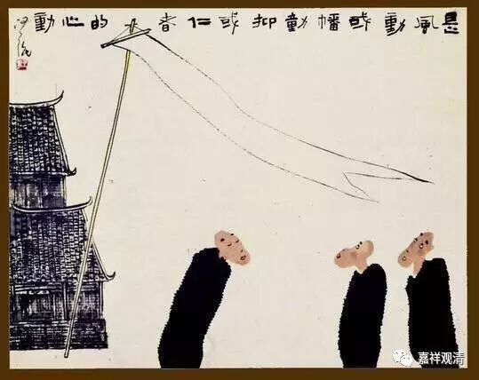

“风、幡、心动”新解

禅门“风动”“幡动”“心动”的公案，谈了千多年，典出《六祖坛经》，各家《灯录》《语录》来回评说，一时口水纷纷、玄之又玄。我们要讨论，不妨先看《坛经》：

**……时有风吹幡动。一僧曰：“风动”；一僧曰：“幡动”。议论不已。**

** 惠能进曰：“非风动，非幡动。仁者，心动！”**

** 一众骇然……**

其实，在我这个师出宗门的“知解宗徒”看来，风动幡动的公案很简单啊。也许只是我们都想得过于复杂了……

先补充一个知识——禅宗早期，是自称为“楞伽师资”的，敦煌有《楞伽师资记》说的就是禅门的早期传承。《楞伽经》，我们知道，是瑜伽行派的重要依据，所以，“楞伽师资”可以说是唯识禅，这有别于牛头一系的中观禅。暂且不表……

好，继续。在唯识角度看来，“幡动”、“风动”、“心动”就很容易理解了。

“幡动”，这是世俗一般人的理解——就是幡被风吹动了嘛！这还有啥说的？！

“风动”，这是从法相的、佛教阿毗达磨的角度来谈：大小乘的《阿毗达磨》都说：“地、水、火、风，坚、湿、暖、动”，四大之中的“风”，以“动”为性——“动”就是“风”的性相、定义、特征，所以说“风动”，在阿毗达磨背景下，无比正确！

“心动”，在唯识角度来谈，法不离心而存在。作为色——物质基础的能造四大种，皆不离心而有，也就是“色非离心而实有”、“外境非有”。那么，四大之一的“风大”，也不离心而有，故曰“心动”。这是正宗楞伽师（唯识派）的观点！

所以，“幡动”、“风动”、“心动”各代表了世俗见、佛教知识论和大乘唯识派的观点，后后略胜前前，如此而已，别无他意。没大家想的那么复杂……

