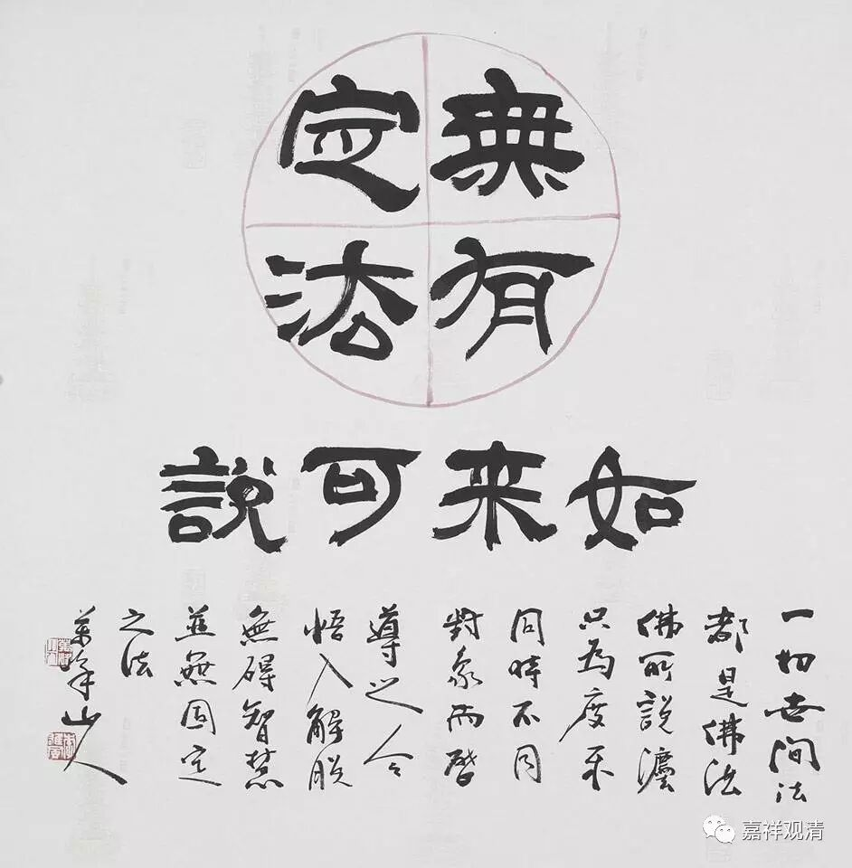

**《金刚经》027（二）**

** “须菩提言：”**须菩提在这里是完全明白的，** “如我解佛所说义，”**如果我了解佛所说的意思的话，** “无有定法，名阿耨多罗三藐三菩提。”**这个** “无有定法”**，千万不要理解错。很多人包括一些法师都是用今天的语言来解释说“没有一定”。这个“定”不是“一定”、“固定”的意思哦，这个“定”是实有的意思，实际上是“无有实法，名阿耨多罗三藐三菩提”。

当年在南北朝时期，这个“定”就是实有的意思。“无有定法”，它不是指“没有一定”，（如上图，说成是“没有固定的法”，呵呵，零分！）如果阿耨多罗三藐三菩提是没有一定的，那还了得了！《金刚经》这里的“定”，包括罗什大师翻译的其它《般若经》里，类似的“定”指的都是“实有”，意思是：没有一个实有的法是阿耨多罗三藐三菩提。明白吗？胜义无！

诸法——一切法，都不是独立实有的存在。中观派还说，“究竟的存在”是没有的。我们讲“胜义无”，胜义无是什么呢？不是说诸法不存在，而是说它无自性，不是究竟的实有，是谛实无、胜义无、自性无的。

所以我们再重复一下，** “无有定法”**的这个“定法”是指实法，不是指一定。我们还得先好好地补一补语文课。前两天有人问：“是不是我们要开门佛教的语文课程啊？”我觉得这个也可以啊！不一定都要是我来讲嘛，我们可以找几位法师来讲讲《高僧传》。

这里的“无有定法”，现在有些人就讲：“哎呀，不是一定的。‘无有定法，名……’哎呀,法无常法，这个是不一定的。”“并无固定之法”……我们有些人认为“法无定法”的背景，就是法不是一定的，是变化的、不固定的——这样的理解是不对的！（现在“文人”多是半文盲。）至少不是这里的意思。无常是无常，非实有是非实有。这个“法无定法”，是指诸法不是实有的存在。一切事物都不是实有的存在，叫“法无定法”，不是指事物是无常的。

** “无有定法，名阿耨多罗三藐三菩提。亦无有定法，如来可说。”**还是一样的，如来所说的法也是无自性的，也不是独立实有的。** “亦无有定法，如来可说。”**绝不是说“如来说法没一定的呀”，不是这个意思哦。“如来说法比较随便，跑到哪里讲到哪里”，不是这个意思哦。

