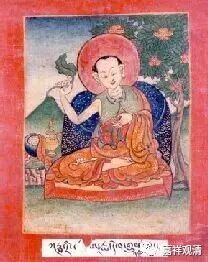

**《金刚经》027（三）**

**
**

** “亦无有定法，如来可说。”**就是说，如来所说的法也不是实有的。这个能够理解吗？它不是独立存在的。佛教认为事物都是缘起的，都是要依赖于其他条件的存在而存在，都是要观待于其他事物的。“观”就是观察的观，“待”就是等待的待。就是对待、相待的意思，这个能够理解吗？

比如说，“彼此”、“出入”、“来去”、“长短”、“高下”、“内外”这都是相待，这里和那里也是相待。

以前提婆大师——龙树菩萨的上首弟子，跟外道辩论的时候也玩这观待。

外道问：“你是谁？”“天。”（他叫提婆嘛，提婆的意思就是天。）

“天是谁？”“我。”

外道又问：“我是谁？”“狗。”

“狗是谁？”“你！”

“你是谁？”“天。”

“天是谁？”“我！”

……

就这样把对方绕进去了。提婆论师的意思就是唯名言，无自性，从这个角度理解，名言只是一个概念，只是一个名词。

“你是谁？”“天（神）。”提婆的名字意思就是天神。

“天是谁（提婆是谁）？”“我。”外道那个人在问“天是谁”的时候，提婆就回答为自己。外道最初可能理解为神是独立存在的实体。

“我是谁？”“狗。”外道在问“我是谁”的时候，在问selfbeing的时候，提婆论师跟他就开玩笑，说对方是狗。

“狗是谁？”“你！”又把这个“狗”顺着上一句话，说成是对方自己，所以提婆回答就说“你”。

“你是谁？”“天。”对方外道又问“你是谁”的时候呢，提婆又变回回答自己。

最后看出提婆的意思，是双关语的玩笑——我是天神，你是狗。

这个问答的背景是什么呢？就是这些文字的背后都没有实意，可以不断变化的。依名则实——认为名字背后有其实体，这是错误的。

据说这个外道在被他绕了几圈以后，就投降了。我觉得这个外道很可爱啊，就这么投降啦？我觉得这种智慧问答好象我们小时候都会回答哦。当然，可能没那么聪明。也许这个外道确实特别聪明，碰到这个就投降了。如果是我的话，可能懵了：“你能不能好好说话？”不过，我们十岁以前这样的问答和大论师们这样问答的性质有些不一样哦。以后大家跟别人玩智力问答，也可以玩这一套哦。

