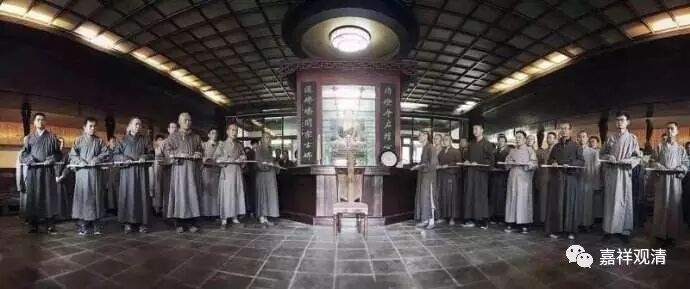

食宿皆随宜，当疾断烦恼

随宜覆身，

随宜住处，

随宜饮食，

疾断烦恼。

这是佛教部派里，大众部系统的鸡胤部著名的偈颂。鸡胤部，又称灰山住部、窟居部，属于北方大众部较早的派别。吉藏大师《三论玄义》介绍此部，说：

*三、灰山住部。前二从执义受名。此因住处为目(此山有石，堪作灰。此部住彼山中修道，故以为名)。其执毘昙是实教，经律为权说故。彼引经偈云：“随宜覆身，随宜饮食，随宜住处，疾断烦恼。”*

*随宜覆身者，有三衣佛亦许，无三衣佛亦许；随宜饮食者，时食佛亦许，非时食亦许。随宜住处者，结界住亦许，不结界亦许。疾断烦恼者，佛意但令疾断烦恼。此部甚精进过馀人也。*

说此部在三藏中更推崇阿毗达磨论藏，认为经、律当中各有方便巧说，有不了义，并引经来证明，就是上面提到的这个颂子——“随宜覆身，随宜饮食，随宜住处，疾断烦恼。”

引这段文的意思是，既然是“随宜”，就不是究竟、了义的“一向说”，所以，他们对戒律条文的执行，多不拘碍。但很智慧多闻，因为善巧阿毗达磨的缘故。又非常精进，因为衣食不拘之外，岌岌关注解脱。

基大师《异部宗轮论述记》也提到鸡胤部，前半和吉藏大师基本没差别，意谓：这是不弘律藏的原因。后面补充了鸡胤部为什么不注重“经”的原因。《异部宗轮论述记》：

*……又颂言：“出家为说法，聪敏必憍慢，须舍为说心，正理正修行。”若为讲经而出家者，讲经必起憍慢，憍慢起故，不得解脱。须舍为说心，应依正理，正勤修行，断烦恼也。故知经是方便，不许说故。唯有对法，是正理也。故此部师，多闻精进，速得出离。*

* *

此部说“出家为说法，聪敏必骄慢”，发心不对，学经反增系缚，所以经藏是方便说，未必能引向解脱。所以对经藏也不太注重。

这和中国的禅宗倒是很能拉起手来——唐中期以后的禅宗主流也是不拘经律，专注解脱。理由，似乎也正差不多呢。

