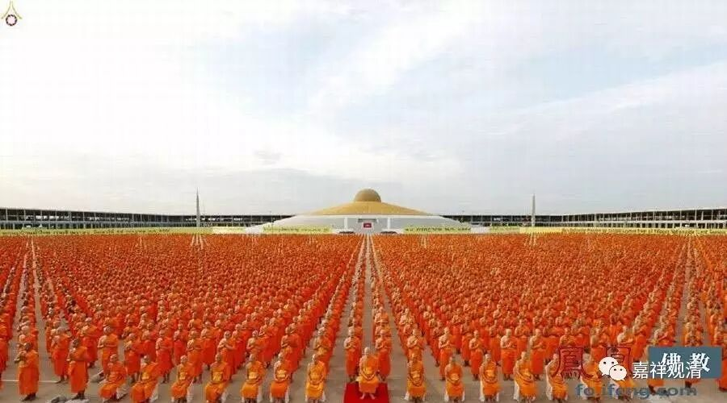

**《金刚经》027（四）**

那么，佛教认为诸法都是什么呢？大乘佛教认为，诸法“无定法”，一切事物都不是独立、实有的，简单说，都是基于它的条件而存在的，或者说最后要基于这个名言而存在的——“唯名言有”。可以称为“自性空”、“胜义空”、“独立实有的空”，这几种理解都是佛教内部对空的不同解释。

** “何以故？如来所说法，皆不可取，不可说，非法，非非法。”**

** **

有些人讲解这里的时候就顺着前面“佛所讲的法没有一定”的讲法——** “皆不可取，不可说”**，别太认真，** “非法，非非法”**，佛教就是一会儿正过来讲这个，一会儿翻过去讲那个。都没有一定的……

《金刚经》是这样的意思吗？不是的！这是在讲** “如来所说法”**是** “不可取”**、** “不可说”**——这是“胜义无”的意思啊！** “非法”**的意思就是法无自性。那么** “非非法”**怎么说呢？还是前面讲的我们的习惯。我们在讲“非法”或者法的自性无的时候，很多人会把自性无当作是一种“有”而成立，所以** “非非法”**的意思就是也不要认为“非法”是一种独立实有的存在。

比如说，我们已经破掉了“得”，就是没有“得”，而我们往往就觉得有一个“无得”在那里。是不是这样？不是的！所以说，** “非法，非非法。”**正面的要否定，负面的也还是要否定。最终它要否定的不是法本身，要否定的是法的自性。如果自性这个问题你没解决的话，你甚至会把“非法”也当作有自性的来执着。所以，** “如来所说法，皆不可取，不可说，非法，非非法”**是这样的意思，不是那种“玄之又玄”的解释。

** “所以者何？一切贤圣，皆以无为法，而有差别。”**这里在其它版本当中是** “一切贤圣皆证无为法”。**这个“贤圣”是个偏义复词，一切贤圣——一切圣者都证无为法。** “而有差别”**是什么意思呢？其实贤圣在无为法上怎么会有差别呢？在证得无为法上是没有差别的。而他们在后得位上是有差别的，在有为法上而显出差别。所以** “皆以无为法”**是在胜义谛上讲的，** “而有差别”**是在世俗谛上讲的。

** “一切贤圣，皆以无为法，而有差别。”**有些版本是写** “皆依无为法”**或者** “皆证无为法”**。** “而有差别”**，是指显示的各个差别。是什么差别呢？比如说接下来会讲的初果、二果、三果、四果、初果向、二果向、三果向、四果向，比如说二十七贤圣……这些在有为法上所显出的差别，就是贤圣的差别。

