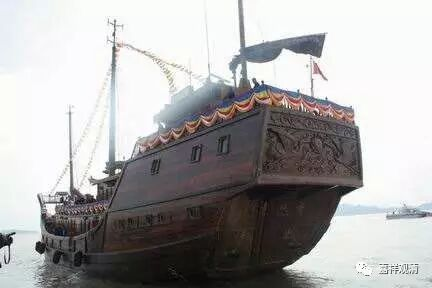
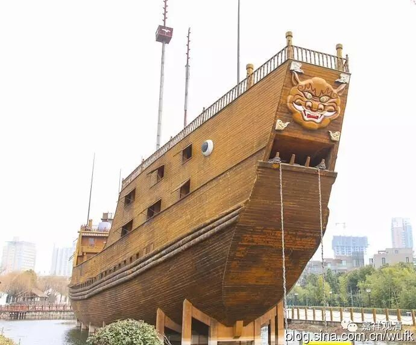

富豪沉宝船出家

《续高僧传》里提到这样一个牛人——释道仙法师。

此人元是康居人（或是侨民），是个大商人，四川江浙往来货卖，珠宝足足装了俩大船，世称巨富。但贪心逾重，还狠钱少……

一次，在牛头山听僧达禅师说法，禅师说：“人这一辈子，从生到死就这么点时间，你最心爱的东西，连身体都带不走，何况财物呢？”（“生死长久，无爱不离；自身尚尔，况复财物。”）

富豪一听，受到刺激了，心想：“我这一辈子就是贪心重啊，钱赚了还要赚，也不嫌够。现在听到佛门妙法，真是无以复加了！钱财终有一天要离我而去！不如把家当都沉了江，无牵无挂，出家求道，无忧无虑，岂不乐哉？！”

于是（带家当）凿沉了一艘……！！！

大家拦着，说：“留着那一半做功德吧！”

富豪说：“留着也是一桩麻烦事，连累自他！”继续又沉了那一半家当！！！

转身，富豪出家了，法名释道仙。也是走的禅师路子。大概是因为放得下，很快修行就上路了，后来神异特胜，追随者众多。南北朝时侯著名的信佛宰相，另一个神人——陆法和，就是他的弟子。（陆法和，我们下来再介绍。）

这位道仙禅师真是放得下啊！

道次第师承里也有这样的祖师，别人供养的珠玉弃如砾石——这都是修出离心的榜样啊！

《续高僧传》卷二十五：

**释道仙，一名僧仙，本康居国人，以游贾为业。往来吴蜀，江海上下，集积珠宝，故其所获赀货乃满两船。时或计者云：“直钱数十万贯。”既瓌宝填委，贪附弥深，惟恨不多，取验吞海。**

** 行贾达于梓州新城郡牛头山，值僧达禅师说法曰：“生死长久，无爱不离；自身尚尔，况复财物。”**

** 仙初闻之，欣勇内发。深思惟曰：“吾在生多贪，志慕积聚。向闻正法，此说极乎！若失、若离，要必当尔！不如沉宝江中，出家离著，索然无扰，岂不乐哉！”**

** 即沉一船深江之中。**

** 又欲更沉，众共止之。令修福业。**

** 仙曰：“终为纷扰，劳苦自他。”**

** 即又沉之。**

