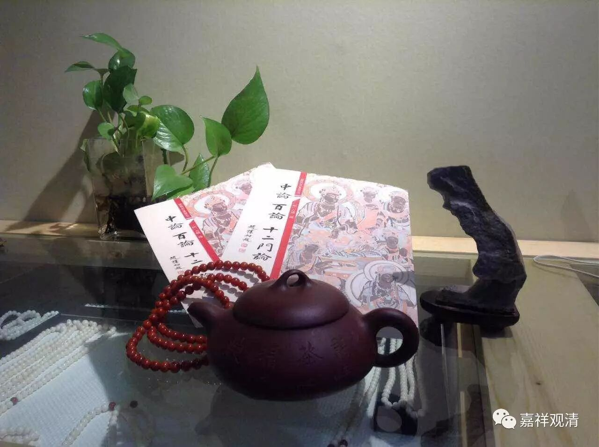

**《金刚经》027（五）**

那么，这些贤圣在证得这些差别的时候，他们的贤圣的共性是什么呢？怎么会都叫圣者呢？他们的共性就是证得无为法、证得自性空。他们证得的是什么呢？就是前面所讲的诸法无自性，** “无有定法，名阿耨多罗三藐三菩提。亦无有定法，如来可说。……如来所说法，皆不可取，不可说，非法，非非法。”**这个就是这些贤圣所证得的对象。他们所证得的对象是什么呢？诸法无自性，一切法无自性。

这一段解释第三个问题的，要一直到下面的** “须菩提，所谓佛法者，即非佛法”**。我们继续看下去。

** “须菩提，于意云何？若人满三千大千世界七宝，以用布施，是人所得福德，宁为多不？”**这样的福德大不大呢？多不多呢？** “须菩提言：‘甚多，世尊。何以故？是福德，即非福德性，是故如来说福德多。’”**福德多不多呢？福德多！福德不是有自性的，所以福德多。这背后是什么意思呢？福德不是有自性的，是指它的胜义谛；如来说得福德多，是指世俗谛。

** “若复有人，于此经中，受持乃至四句偈等，为他人说，其福胜彼。”**这是什么意思呢？这个是在较量功德，后面还会其他的有较量功德。意思就是智慧的背景要远远超过方便的背景。

** “……其福胜彼。何以故？须菩提，一切诸佛，及诸佛阿耨多罗三藐三菩提法，皆从此经出。”**因为佛出世的本怀，就是要给大家讲解脱的法。如果是单单福德的话，一般撞也可能撞得到一点吧？** “一切诸佛，及诸佛阿耨多罗三藐三菩提法，皆从此经出。”**这两天我们在讲《现观》，也是一样的背景：“菩萨若欲证阿耨多罗三藐三菩提，应学般若波罗蜜多。”对吧？也就是这个意思。“菩萨欲证阿耨多罗三藐三菩提，应学般若波罗蜜多。”** “皆从此经出”**，这个经是指什么呢？《般若波罗蜜经》。所以呢，一切** “皆从此经出”**，一切诸佛的微妙善法皆从此经出。

** “须菩提，所谓佛法者，即非佛法。”**这个佛法是什么呢？** “所谓佛法者”**指的是缘起有，或者是世俗有，“** 即非佛法”**指的是佛法无自性。

这一段是在讲什么呢？“信解者难得，为什么还要说法？”那么，佛法有没有自性呢？无自性！（这个无自性、非实有，不是中观派的，梦不到这个滋味……）

今天先到这里，谢谢大家！

