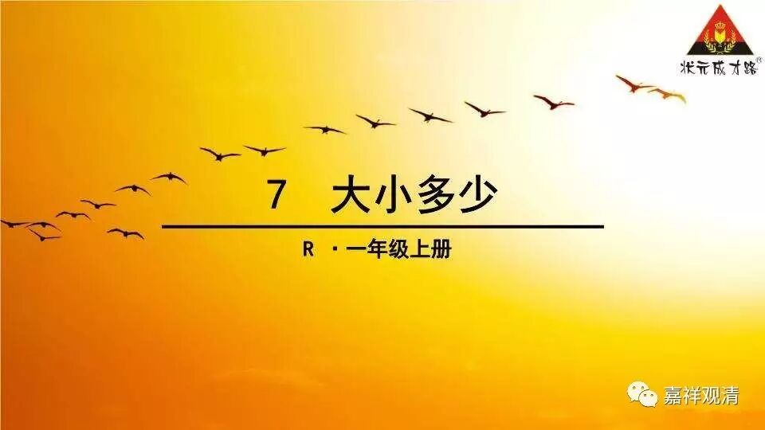

**《金刚经》 028（上）**

** **

我们继续《金刚经》。

我们已经讲到了第三个问题。前面第二个问题是：“此法甚深，云何得有信者？”这么深的法，大家怎么能够理解呢？这个问题解决完了以后，就出现了第三个问题：“信解者难得，为什么还要说法？”

对应的这一段是：** “须菩提，于意云何，如来得阿耨多罗三藐三菩提耶？如来有所说法耶？”**阿耨多罗三藐三菩提也好，如来所说的法也好，都是无有实相。这一段里面的“定”呢，是指无有实相，或者无有独立的自相，或者无有独立的自性——这要看从哪个宗派的观点去说。

接下去，** “须菩提！于意云何，若人满三千大千世界七宝，以用布施，是人所得福德，宁为多不？”**这一段是在较量功德，在《金刚经》当中经常会有较量功德的部分。这里有点像“赋比兴”的兴起，起一个话头。** “须菩提，于意云何，”**我来问你，须菩提，** “若人满三千大千世界七宝，”**用填满三千大千世界这么多的七宝来布施，这样的人的布施福德多不多呢？

** “须菩提言：‘甚多，世尊。’”**须菩提很聪明，说：“多。”为什么呢？** “何以故？是福德，即非福德性……”**这个福德也是一样，也不是有自性的。我们倒过来讲，假如福德是有自性的话，它就是没有变化的，不能增，也不能减，那就谈不上多少的问题，所以一定要较量功德的话，也必须是无自性的。（不过呢，这话也只能中观派内部自己说，别人可不答应。无自性才能成立诸法，其他宗派的人都理解不了。）

** “是福德，即非福德性……”**这样的福德呢，是无自性的。没有自性的福德，是依缘而建立的。依缘而建立的话，就会有它的世俗相。有了世俗相呢，就出现了大小、多少、因缘聚集等等，这样就有互相之间较量功德的基础。如果是实有的话，就没法较量。“较量”就是比较，就是观待嘛。那个山观待这个山，那叫“彼”，这叫“此”。互相比较，就有相待，就不是实有，就不是有自性。

自性是什么呢？简单说，“自性”就是自己决定自己的。假如自己决定自己的话，大小也是它自己决定自己的，根本不需要和其他比较。“这个东西本身就是大的”——这是不可能的，因为大小是相对而言的，“大小”、“彼此”都是相对的。离开了比较，离开了观待的对照，当然是没有办法去比大小、比多少的。既然大小、多少需要互相观待，那么这个法就不能是有自性的，因为“自性”是自己决定自己的，不是由别的其他事物所决定的，是由自己决定自己的。但是大小、多少很显然是互相决定的，是互相比照而决定的，所以这里就讲了这句话：** “是福德，即非福德性，是故如来说福德多。”**因为这个福德性是没有自性的，所以才可以比较。而以与空相应的智慧来布施，这样的福德要更多。

