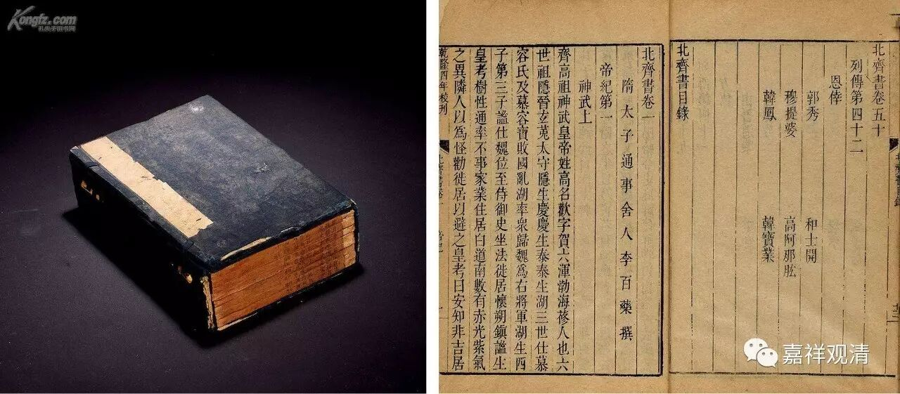

太尉陆法和的故事

南北朝时期，佛教传播很盛，南北皆然。崇佛和灭佛事件皆有。陆法和是南人，而后败投北齐，南人而入北朝，那个时代纷乱背景下也不少见。

陆法和先以居士身而从学、侍奉于当时名僧——释道仙禅师。后出世，任信州刺史。此时值侯景之乱，他用奇兵定侯景之偏师任约，“断侯景一臂”，至巴陵，将战防移交王僧辩。乃回师巫峡防蜀，果如其虑，以铁索横江，一战击溃蜀军。

后梁元帝封他为都督、郢州刺史，封江乘县公。因为功业稍重，加封司徒——即三公之一。复因功高权重而被疑，他虽自证清白，仍不得信任。不久南朝梁室崩溃，北齐趁机出兵，陆法和等皆降。此即南人而至北朝。

到北朝后，官位不降，至“大都督十州诸军事、大尉公、西南道大行台”，实际对南朝降将而言，得到的只是虚职，并无实权。此后陆法和巧妙地借用了自己的居士身份，远离权力核心。有一次，获皇帝赐与“钱百万、物千段、甲第一区、田一百顷、奴婢二百人”，他把财物全部施舍出去，奴婢放归。并改自宅为佛寺，起居和常人没有什么区别。其实这也许是一种乱世之中明哲保身的无奈之举。

《北史》和《北齐史》里记载，陆法和颇有神奇的用兵，大概也是后来因为他信佛虔诚（行为）而带来的比附，生擒任约一战，或说为一次漂亮的伏击。

