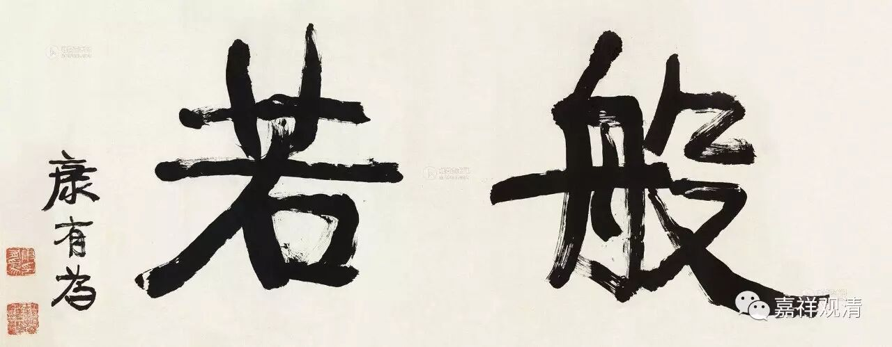

**《金刚经》028（中）**

** “若复有人，于此经中，受持乃至四句偈等，为他人说，其福胜彼。”**这里的经，是指什么经呢？其实不单单指《金刚经》，而是指所有的般若经。如果有人在般若经中** “受持乃至四句偈等”**，受持、书写、读诵、辗转、流通（今天的印刷）等等。** “乃至四句偈”**，乃至下到四句偈。这里四句偈的意思是指一段文字，不是很确定的一个四句偈。上次我们已经讲过了，这个“四句偈”是指计数用的，它是一个约数，不是一个实数。比如我们把《金刚经》称为五百偈，其实它并没有从头到尾都是偈子。吉藏大师就专门讲过，这个四句偈不是指哪四句，就是一段文字就可以了。

** “受持乃至四句偈等，为他人说，其福胜彼。”**在《金刚经》的教法中随便取出一段去给别人开演，这样的福德要超过之前的那个福德。正因为福德是无自性的，才能够这样互相比较，说这个超过那个。

** “其福胜彼**。** 何以故？须菩提，一切诸佛，及诸佛阿耨多罗三藐三菩提法，皆从此经出。”**为什么呢？** “一切诸佛……皆从此经出。”**这里的“此经”不单单指《金刚经》，而是指所有的般若经。** “及诸佛阿耨多罗三藐三菩提法”**，如果想成佛，究竟解脱的话，也是要依般若波罗蜜多。我们看，在《大般若经》中也是不断地强调：菩萨欲得阿耨多罗三藐三菩提，当学般若波罗蜜多；菩萨欲利益众生，当学般若波罗蜜多……《心经》里也讲：** “菩提萨埵，依般若波罗蜜多故……三世诸佛，依般若波罗蜜多故，得阿耨多罗三藐三菩提。”**菩萨通过修习般若波罗蜜多，能够证得，三世诸佛也通过般若波罗蜜多来证得阿耨多罗三藐三菩提。

看回来：** “何以故？须菩提，一切诸佛，及诸佛阿耨多罗三藐三菩提法，皆从此经出。”**这里的“此经”不是单指这部经，是指佛所讲的般若波罗蜜多相关的教言。我们依靠这个最核心的智慧能够到彼岸，能够获得究竟的解脱。

这一段的最后一句话：** “须菩提，所谓佛法者，即非佛法。”**我们再看上面这句：** “何以故？须菩提，一切诸佛，及诸佛阿耨多罗三藐三菩提法，皆从此经出。”**这句话讲完以后，不聪明的人就会觉得其他东西都不是实有的，那么最重要的就是佛陀讲的般若波罗蜜多，马上认为佛陀讲的这个殊胜的教法是实有的。而最后这句话就是要把大家这个实有的观念去掉，我们有些人的习惯的确如此，所以接下去马上要随方解敷。

** “须菩提，所谓佛法者，即非佛法。”**须菩提，告诉你，刚才我们所讲的，佛所开演的般若波罗蜜多的教法，它也不是有自性的，也不是实有的。假如它是一个实有的法，它就不需要佛来开演，我们也没有办法通过实修它来获得阿耨多罗三藐三菩提。般若波罗蜜多这个佛法本身，并非是实有的，所以我们才可以通过它去学习，去证得阿耨多罗三藐三菩提。

