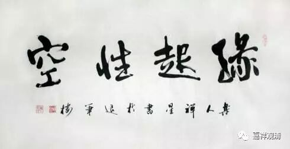

**《金刚经》028（下）**

我们曾经讲过，通过基位的般若（教般若）和道般若，最后成就果般若。我们通过学习最基础的文字，然后自己去实践，最后达到最终的结果。这就说明可以通过文字，我们来获得，然后不断地增长，会有这样的因果性。既然是因果性的，就有了它的缘起性，而它的缘起性的背后，又表明它是没有自性的——不是自己决定自己的那种存在，是依赖其他事物的存在。

关于无自性，我们不妨再多说两句。自性这个词是一个印度的单词，有点像英文里面的self-being，自存的、自有的、自在的。什么意思呢？就是我是不依靠别人的，我的存在就是我存在本身决定的。就是一样东西它存在，是依自身存在的本身所决定的，这个就称为自性。简单的物质方面的例子，假如，假如我们认为——最终的物质的构成单位是是原子，或者是夸克，这个最小单位不是基于其他条件而存在的，它就是它自己——类似这种观念就是“有自性”的。认为这种东西是不变的，所处的地方可能变，它本身是不变的——这就是一种自性有。或者如果从宗教的角度来说，就类似上帝那个概念——上帝，不是由其它所造的，它是自己决定自己的，但它可以造出别的。这个大致明白了吗？

自性的概念，或自存的概念，或自有的概念，就是它不受到别的影响。它本身就是它，它可能造成对别人的影响，我们另外再说（它既然要影响别人，就很难说它是自存的了）。自存的概念，它的意思就是它不依赖于其他条件而存在。实际上这种（不依赖于其他条件的）东西就没有，就不存在。佛教里面讲一切事物的存在都需要依赖其他的条件。最明显的就是彼此、自他，还有前面所讲的大小、高下、方圆……这些都是针对的、相待的。

所以宗喀巴大师的《缘起赞》当中说“自性无作待”，自性，就是无作、无待。自性是非造作的，叫无作。自性又是无待的，自己决定自己的事情，不观待其他条件，不参考其他条件。这就叫“自性无作、待”。与此同时，“缘起有作待”。缘起的意思是什么呢？它是由其他条件而造作出来的，是观待其他条件而成立的。

自性和缘起这两个是没有办法调和的，假如你承认缘起的话，就一定不能承认有自性，因为这两个是矛盾的。既然诸法这样因缘生，或者因因果果这样地延续，或者这样地变化，那我们就说诸法是无自性的。它不是自性的存在，不是独立实有的存在。

那么，功德也是一样。功德如果是有自性的话，你也没法用，因为你一用的话，它又要有“能”和“所”了嘛，就要有变化了，或者从种子位到现行位，它又是有变化了。所以功德也是无自性才有，也是因为无自性的功德才可以比较。般若波罗蜜多，也是因为它的无自性，我们才可以通过它从文字般若到道般若，最后到果般若。

今天先到这里，我们讲了第三个问题：“信解者难得，为什么还要说法？”那么，这个法是什么呢？这个法仍然不是实有的法。这个法一方面是缘起的，佛陀的教法是有的，另一方面呢，这个法不是实有的，也是无自性的

