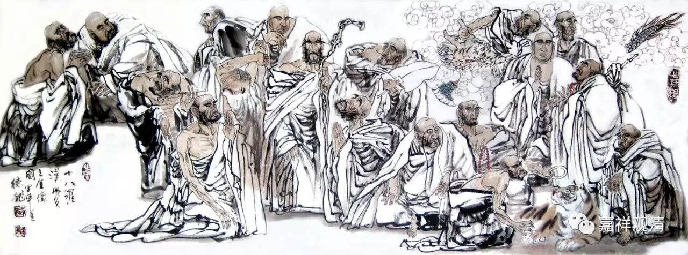

**《金刚经》029（中）**

我们把文字先过一下。

** “须菩提，于意云何，须陀洹能作是念——‘我得须陀洹果’不？”**释迦牟尼佛就问：“须菩提啊，我来问你，须沱恒（就是证得初果的圣者），他证得了七返果（预流果），他是不是有这样的想法：‘我得须沱洹果。’有没有这样的想法呢？”他在证果的时候有没有** “我得须沱洹果”**这个概念呢？

这可不能有啊！要是正证初果的圣者有这个概念的话，那就是有我执了，有实有的概念了，有我执的话，就不能证圣果。所以，不能是这样的。如果你突然之间去问他，他会不会产生这个“我的”随顺的语言呢？会不会表现出来呢？应该不会，特别在证果的背景下，不会。

** “须菩提言：‘不也，世尊。何以故？须陀洹名为入流**（又叫预流）** ，而无所入，不入色、声、香、味、触、法，是名须陀洹。’”**入圣者之流，不入色、声、香、味、触、法。“不入色、声、香、味、触、法”也可以说是：不认为色、声、香、味、触、法这些是实有的。须沱恒本身也是一样，他会不会认为** “我得须沱恒果”**？不会的。须沱恒果也是无自性的。你如果问他的话，他知道诸法都是无自性的，他是证得诸法无自性的。

** “须菩提，于意云何，斯陀含能作是念——‘我得斯陀含果’不？”**斯沱含是一来。** “须菩提言：‘不也，世尊。何以故？斯陀含名一往来，而实无往来，是名斯陀含。’”**

** **

斯陀含，是“一来果”，意思是再来一次，全面一点说呢，就是“往”了以后最多再“来”一次，所以这里从“往来”来谈一来果。“往来”这个事情或者斯陀含这个事情，也是无谛实的，或者是无实有的，或者是无自性的。斯陀含是不会在“往来”这个上面有自性执的，在后得位上或生实有的显现，但是他一分别的话就会马上想起来——诸法无自性。这在前三果都一样。

