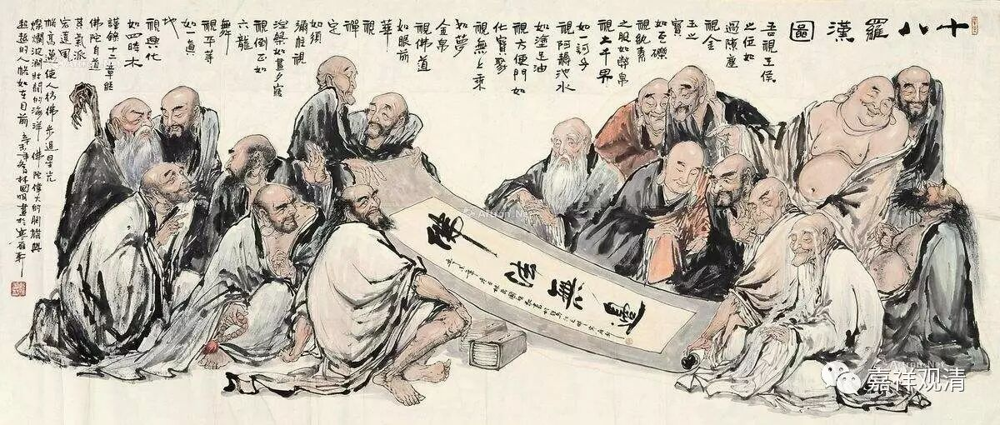

**《金刚经》029（下）**

** “须菩提，于意云何，阿那含能作是念——‘我得阿那含果’不？”**须菩提，现在我来问你，阿那含（就是不还果）会不会认为“我得不还果”呢？这和前面是一样的。** “须菩提言：‘不也，世尊。何以故？阿那含名为不来，而实无不来，是故名阿那含。’”**这里的“无不来”，有些人误认为就是一直来、全部都来的意思——不是这个意思哦，理解错了。** “实无”**，无的是什么呢？无“不来”——“不来”就是不还果，不还果就是阿那含果。这句话的意思应该是阿那含果也不是实有的，也不是独立实有的存在，也不是自性有的存在，** “是故名阿那含。”**如果他认为这是实有的话，那他就不是圣者了。前面讲过，一切贤圣皆证无为法，他是证得谛实空或者自性空的。

** “须菩提，于意云何，阿罗汉能作是念——‘我得阿罗汉道’不？”**这个问题和前面是一样的。这个阿罗汉道也就是阿罗汉果的意思。须菩提，于意云何，阿罗汉——已经证得四果的无学圣者，他会不会这样认为‘我得阿罗汉果’了？我们结合《心经》来讲的话，他如果真的认为有智有得，得阿罗汉果的话，那就不是圣者了，那就认为是自性有的，必定是凡夫了。他是圣者的话，一定不会有“我得阿罗汉道”或“我得阿罗汉果”的这种认知出现。

** “须菩提言：‘不也，世尊。何以故？实无有法名阿罗汉。’”“实无有法名阿罗汉”**，不妨把次序稍微倒一下，就是：“阿罗汉，无有实法。”阿罗汉也不是实有的。

有些人会问：“哎？如果不是实有的，那要证阿罗汉干吗？阿罗汉不是实有的，那干嘛要证啊？”“阿罗汉果非实有”不是“阿罗汉果没有”的意思（但这个意思，中观以下很难理解到）。四果有没有呢？四果是有的。四果是不是谛实有、自性有呢？四果不是谛实有、自性有的。四果如果没有的话，那我们干嘛要证呢？但是四果如果是谛实有的话，你根本就证不到啊！因为它如果是谛实有的，就没有办法变化，就是不观待的，就不依缘起的。正是因为它不是谛实有的，它是依缘起的，我们才可以证到它，由道谛而证得灭谛。

** “须菩提言：‘不也，世尊。何以故？实无有法名阿罗汉。’”**阿罗汉也不是实有的。阿罗汉证得圣位，是要证得无为法的，要证得一切法无谛实、一切法自性空，他们已经全部断完了见所断的烦恼和修所断的烦恼。

这一段其实还没讲完，那么我先总结一下。这一段前面讲了：一切贤圣皆证无为法。在《般若经》当中，处处谈空，就会有人想：“咦？既然谈说胜义中无这些智、无这些果，为什么又说要一切贤圣皆证无为法呢？”真正的答案是什么呢？我们再总结一下。有没有这些果呢？有！这些果是不是谛实有的呢？不是！我们如果要仔细地讲《般若经》的话，应该先讲二谛的。阿罗汉果等的四果四向有没有呢？世俗有，在二谛当中世俗有。它是不是胜义有呢？它不是胜义有。如果胜义有的话，就不能见空了，那就不证无为法了。

好，今天先到这里，谢谢大家！

