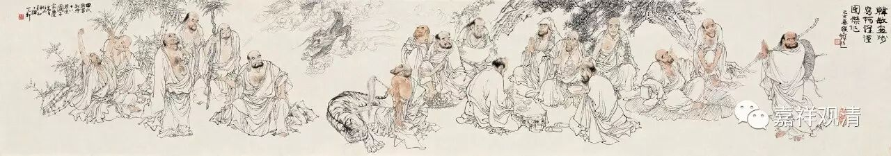

**《金刚经》030（中）**

这两天也有人在问四果的差别在哪里，差别就是在后得位上的差别，比如在修所断的烦恼方面，根本的无明不算，贪嗔痴慢疑分别断了多少，可以数一数。如果要看差别的话，就在这里。还有一种差别是跟禅定有关的，我们就不在这里讲了。

相对来说，我们这个微课堂是比较轻松的，讲得泛泛一点，要不然又要画图表的话，就有点复杂了。微课堂的表达不是特别精确的那种，只是泛泛地讲一讲，应该知道的文字让大家了解一下。

以上就是四果四向。现在我们继续。** “须菩提，于意云何，阿罗汉能作是念——‘我得阿罗汉道’不？”**须菩提，我来问你，阿罗汉能不能有这样的想法——“我得阿罗汉道”？** “须菩提言：‘不也，世尊。’”**须菩提回答说：“不是这样的，世尊。”这个“不”字应该念“fǒu”。** “何以故？实无有法名阿罗汉。”**也可以说：“无有实法，名阿罗汉。”阿罗汉不是实有的。如果认为阿罗汉是实有的，那这个人是没有证得空性的，不可能被称为阿罗汉，甚至都不可能称得上预流果的须陀洹果。

接下去，须菩提进行了解释。** “世尊，若阿罗汉作是念——‘我得阿罗汉道’，即著我、人、众生、寿者。”**在所有的般若经当中主要谈的都是胜义，那么这里也是一样。

如果按照中观自续派来说，是要加一个词的——“在胜义当中”或者说“观察胜义当中”，他不会有这样的念头——“我得阿罗汉道”。如果在出定以后的世俗当中，他是不是得阿罗汉道呢？得阿罗汉道！但是他在观察胜义谛的时候，他是不会有这些观念——“我得须陀洹果”、“我得斯陀含果”、“我得阿那含果”、“我得阿罗汉果”，是不会有这样的观念的。

他在观察诸法的真实的时候，有没有这样的认知呢？不可能！不可以有！为什么呢？因为如果在观察胜义的时候，他认为有一个“我得阿罗汉果”、“我得须陀洹果”、“我得斯陀含果”、“我得阿那含果”等等，** “即著我、人、众生、寿者。”**假如他在观察诸法实相的时候，最终认为有一个被肯定的阿罗汉、阿那含、须陀洹、斯陀含这些，** “即著我、人、众生、寿者。”**这个人就是有我执的了。如果有我执的话，他就不是圣者。前面我们讲过，“一切贤圣皆证无为法”，他要证得无为法，他要证空的，如果他还有我执的话，是没有证空的。

所以须菩提在这里补充了一句：** “世尊，若阿罗汉作是念——‘我得阿罗汉道’，即著我、人、众生、寿者。”**我们还要再补充几个字，阿罗汉在观察胜义的时候不会有“我得阿罗汉道”这样的想法。前面的三果也是一样。

