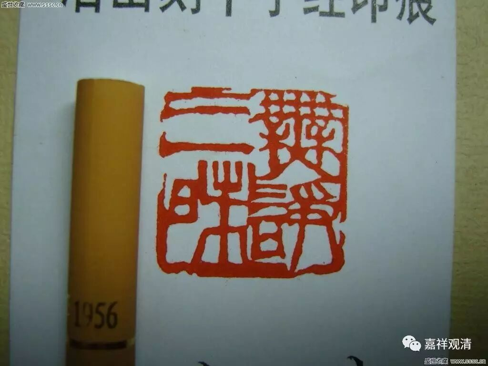

**《金刚经》030（下）**

** “世尊，佛说我得无诤三昧人中，最为第一……”**这句话应该是这样念的：佛说，我，是在得无诤三昧的人当中，最为第一的。很多人断为“佛说我得无诤三昧，人中最为第一”，这种断句是错误的。

这里我们先读过去，待会再讲什么叫无诤三昧。** “……是第一离欲阿罗汉。”**阿罗汉本身就是离欲的。** “世尊，我不作是念——‘我是离欲阿罗汉’。”**这个离欲阿罗汉和前面的无诤三昧是有关的。“世尊是这么夸奖我的”，但是须菩提有没有这样的想法呢？假如须菩提在证空性的时候有这样想法的话，那他也没有证得空性。

所以他说：** “世尊，我不作是念——‘我是离欲阿罗汉’。世尊，我若作是念——‘我得阿罗汉道’，世尊则不说‘须菩提是乐阿兰那行者’……”**这个阿兰那也是无诤三昧。是乐无诤三昧的吗？不是。** “……以须菩提实无所行，而名‘须菩提是乐阿兰那行’。”**这里我们再把它分成二谛来讲，在世俗谛上有没有得乐阿兰那行、有没有得无诤三昧、有没有离欲行？——这三个是同义的。在世俗谛上有没有呢？有！但是在证胜义的时候，他的观念中就绝不可能有“我是什么”这样一种肯定，一旦有的话他就是凡夫，也没有证得圣位。

我们来讲一下无诤三昧，乐阿兰那行和离欲行都是指向这个无诤三昧的。

对于无诤三昧有三种说法：

第一种说法，证阿罗汉果就称为叫无诤三昧。无诤是指无烦恼，诤就是指烦恼。阿兰那——闲静处，也是跟无诤三昧有关。无诤三昧在早期还有一些特殊的含意。所以，第一种无诤三昧就是指的无烦恼三昧，证阿罗汉的人就证得无诤三昧了。但这个“无诤三昧”不是这里所讲的。

第二种无诤三昧，是说一种很厉害的阿罗汉——有禅定有神通的阿罗汉，他有一种“愿智”，是和神通有关的。比如你问一个问题，他就坐下来入定，入这个“愿智”想一想，就会把这个答案告诉你，而且这个答案是正确的。比如，他出去化缘的时候，先入愿智，就是坐下来观察一下：东边过去五里远的地方，大家会骂我，对我不好倒不重要，但对他们会麻烦，所以我不能去。然后再观察，去南边化缘不错，对他们会有很大的利益——这个好，然后出定。这是在“愿智”当中获得了神通，了知了这些以后呢，他就去那些能够适当帮助对方的地方，而不会去那些会产生争讼的地方，这个就叫“无诤三昧”。如果有这个无诤三昧的话，属于罗汉当中比较厉害的。当然，佛也有无诤三昧，但佛是一刹那知，不需要再刻意入定观察。

第三种无诤三昧，其实是直接指向须菩提本人的。须菩提在证罗汉以前，用我们今天的话来讲，是一个话挺多的人。可能就像今天我们这些喜欢辩论的人，没事就喜欢找人辩论，类似于跟人家吵架等等，把人家搞得头都大了。但他证得阿罗汉以后，这种情况就没有了，所以又称他为无诤三昧。

所以这个无诤三昧有三种意思：

第一种是无烦恼三昧，所有阿罗汉都证得的。

第二种是基于阿罗汉的神通，由愿智而得的利益众生的方向——这和大乘的利益众生是不一样的，不在那个地方产生斗讼、麻烦等等，叫无诤三昧。那么，佛也有无诤三昧，大乘里面也讲无诤三昧的，佛是一刹那智的。

第三种呢，是基于须菩提他本人的一个情况，他原先喜欢跟人家吵架、辩论，好像也被释迦牟尼佛批评过，在证得罗汉果以后，就没这种情况了，所以也称他为无诤三昧。

在《金刚经》这里的无诤三昧，好像第二种、第三种意思都可以，哪个更合适一点，大家自己挑吧。我觉得，是第二种，但不是佛的无诤三昧，是阿罗汉的无诤三昧。须菩提的无诤三昧，从原意来说应该是和第三种有关。“无诤三昧……最为第一”，得这个第一的名字，估计主要还是第三种的原因。后来无诤三昧的意义又扩大了，就是前面讲的第一种意思，无诤的这个“诤”变成了烦恼，“无诤”就解释为无烦恼，所以也有罗汉都得无诤三昧的说法。

好了，今天先到这里，谢谢大家。

