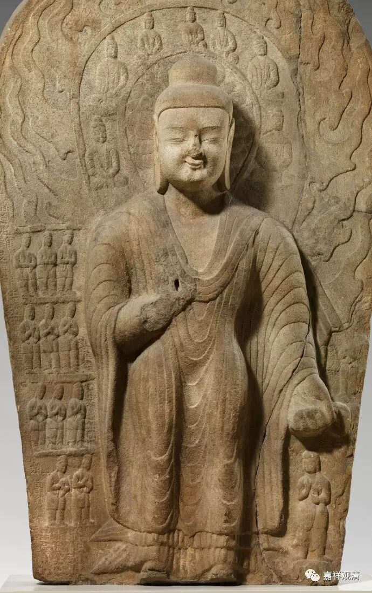

****

** 《金刚经》031（下）**

** “佛告须菩提：‘于意云何，如来昔在燃灯佛所，于法有所得不？’”**为什么这么问呢？因为大家可能会觉得，大乘是不是会有所得。这里为什么会提到燃灯佛所呢？因为在其他经典当中会提到，释迦牟尼佛的前生在燃灯佛的面前得菩提记：“你将来，在XXX阿僧祗劫以后，得阿耨多罗三藐三菩提，名字叫乔达摩·悉达多，属于刹帝利种姓……在菩提道场娑罗树下证得阿耨多罗三藐三菩提。”有过这样一个授记，得阿耨多罗三藐三菩提的记。记就是授记，就是预言的意思。经典当中是有这样一个预言的。

前面讲完了小乘的贤圣差别以后，就会有人问：那大乘有没有取、有没有证呢？我们在一个东西被破掉以后，总是习惯性地接下去找别的。“小乘是这样的，那大乘呢？释迦牟尼佛是在燃灯佛面前得到菩提记的吧？”释迦牟尼佛马上就开始问须菩提：** “如来昔在燃灯佛所，”**释迦如来以前在燃灯佛的面前，** “于法有所得不？”**他有得到什么吗?

** “不也，世尊，如来在燃灯佛所，于法实无所得。”**在那个时候，如来实无所得。就大乘而言，那个时候应该是指证得八地的时候，是已经超出阿罗汉的，智慧和福报都要超出阿罗汉的。那么这个时候，他是不是有得、有证呢？答案还是一样：在胜义上来说，无得、无证。如果菩萨在证得八地的时候，觉得自己有得、有证，那根本就没有证果。所以这里面就用到了这样一个典故。

** “如来昔在燃灯佛所，于法有所得不？”**我们现在再来问大家：有所得吗？要知道，这里前前后后都在讲胜义谛。如果是中观自续派的话，就觉得这里从头到底都要加“胜义”这两个字，是吧？其实不用加就可以知道这个意思的，这里都在谈诸法的究竟存在与否，在胜义的圣根本无分别智的情况下观察，诸法的究竟存在到底有没有呢？释迦牟尼佛在往昔生中，在得阿耨多罗三藐三菩提记的时候，他是不是“有所得人”呢？他不是“有所得人”。他在燃灯佛的面前，** “于法实无所得。”**

** **

所以，第四个问题中说“一切圣贤皆证无为法”，而这里的第五个问题就是：“二乘是这样的，大乘是怎么样的呢？”那么，大乘也还是如此。初发心的菩萨，他的福报就胜过小乘的声闻、缘觉。而大乘的八地菩萨，不管是福德资粮也好，智慧资粮也好，广度也好，深度也好，都要超出声闻、缘觉罗汉。所以前面讲了小乘的声闻、缘觉罗汉的果位以后，后面就讲大乘的果位的情况。

好，今天先到这里，谢谢大家！

