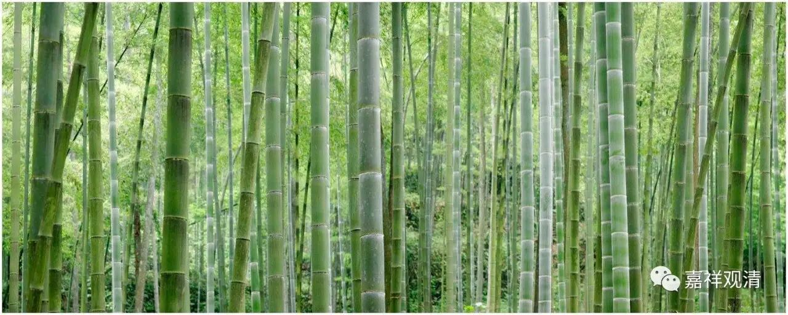

**《每日一偈》17-4**

尽形寿，不杀生，汝能持否？

凡诸有，唯施设，其自性空。

如诸调驭师，善治于车乘；

有志勤比丘，当善调驭心。

皈依、修福业，出离、胜意乐；

渐备众德已，得无上菩提。

犹如吉祥与黑耳，有为之法具生灭；

刹那不曾暂留住，非是坚实当思择。

注释：印度神话里，福神叫“吉祥”，穷神叫“黑耳”。两姐妹同出同入，曾不暂离。

世乐增长时，现见转作苦；

然非苦增长，复能转作乐。

如四大海水，味咸等无异；

佛海水无量，趣解脱无异。

或有以暴制暴事，定无以瞋除瞋者。

慈心能熄瞋毒火，至尊导师如是说。

内外诸证会，不离止观门。

归元无二路，方便有多途。

佛出法教妙甘露，非示神迹赐涅槃；

唯依三学闻思修，殷勤自证而解脱。

佛教的解脱是依善教导而自力的，所以呢，不要老是嚷嚷“佛啊！你怎么还不来救我！”

世间反复颠倒颠，有情随逐恒流转。

然幸值遇佛圣教，无明痼疾获良药。

多时瞋其多，少时瞋其少；

若谁瞋行者，恒时生瞋恼。

醒觉种姓，

趣求解脱，

志向涅槃

——就在今生！

自信：

无论抛出多少次反面，

仍然坚信，

只要我继续，

总有抛出正面的那一天！

知法离前际，及离于后际，

如幻平等者，能通达般若。

诸色谓变坏，身心受逼迫。

世间惑所生，故无非是苦。

初应多闻求理解，次则观察别是非；

通达空性堪教他，慧炬炽然不复惑。

——《法句经》

上智者求智，次则求知识；

愚者转智识，成惰性知识。

聪明人求点金术，一般人则求金银本身；愚痴的人，则只蓄积金银而不能用。

世荣增我慢，优养误学修；

狂狷不接世，勤苦观无常。

若遇善导游，无劳安逸行；

值遇善知识，出世之捷径。

想我有善根，处盛世无忧；

今若不精勤，何能再值此！

因病转求医，体弱思健身；

智识若有缺，似无虑及者。

知苦苦者多，知乐苦者少；

取蕴行苦性，知见者寥寥。

不杀不盗淫，不妄语饮酒；

五戒善持守，于世若无害。

无明生苦，无明生忧；

断除无明，何苦何忧。

幡动风动复心动，世俗、性相与唯识；

伪禅摒弃闻思慧，千年纷纷秀无知。

“大唐国内无禅师，不是无禅是无师”。

迩来圣教欲敷演，不患无书患无师。

愚谓我恬淡，无作无分别；

智者善知此，种种皆无明。

愚痴的人觉得自己各种无分别，跟佛也就差一层纸；智者看来，那些所谓的“恬淡”、“自在”、“无分别”，都只是无明的种种表现而已。

为断诸有缚，当勤修等持；

功德定相应，必获难思慧。

随宜饮食，随宜覆身，

随宜住处，速趣涅槃！

初少欲知足，除利养毒刺，

更殷勤断证，解脱速可期。

