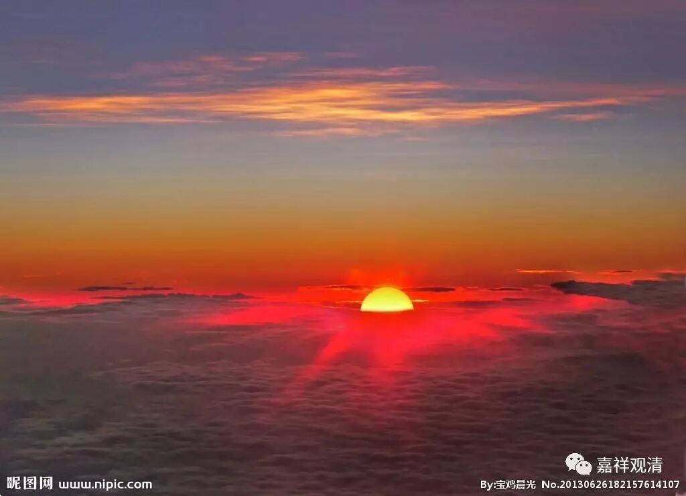

**《金刚经》032（上）**

好，我们继续《金刚经》。

前面讲到** “一切贤圣皆证无为法”**，或者** “皆以无为法有差别”**。那么，声闻乘是这样的，大乘怎么样呢？在这里的第五个问题就是：声闻、缘觉乘固然是这样，大乘也还是一样。所以就说了下面这一段，文字不多哦。

** “佛告须菩提：‘于意云何，如来昔在燃灯佛所，于法有所得不？’”**在燃灯佛的时候，他证得第八地，在这之前是第七地，对吧？** “不也，世尊，如来在燃灯佛所，于法实无所得。”**也还是一样，得什么呢？得了个“无得”，是吧？如果他有“实有所得”的这种认知的话，他就不证了。所以，第五个问题是：大乘也是无所得吗？答案就是：大乘证果也必须无所得——一切的存在皆无自性可得。

再下面一个问题就会这样考虑：大乘也无所得，但是你说的是在燃灯佛之前，当时的释迦菩萨证得的是第七地，那第七地以下就算承认，而再往上的八、九、十这三地的菩萨是怎么样呢？我们通常把八、九、十这三地称为“三清净地”。

小乘的果位一般说是四个果——预流果、一来果、不还果和阿罗汉果，或者说四果四向，还包括四个向。按照中观应成派来讲，最后证到阿罗汉果位的时候，是断尽了烦恼障的。

在《入中论》里面讲“彼至远行慧亦胜”，这个“远行”就是远行地，指的是菩萨十地中的第七地。第八地呢，叫不动地；第九地呢，善慧地；第十地呢，法云地；再以后就是佛地。在第七地的时候，菩萨的智慧和福德都要超过二乘，所以在第五个问题当中，就是以当时证得第七地的释迦菩萨见燃灯佛为例证。

在第七地以前，初地是极欢喜地；二地呢，离垢地；三地呢，发光地；四地呢，焰慧地；五地，极难胜地，和禅定有关的；六地是现前地；第七地就是远行地；第八地呢，不动地；第九地呢，善慧地；第十地是法云地。这就是菩萨十地。

那么，在第七地呢，智慧是超过阿罗汉的。释迦菩萨在燃灯佛面前是从第七地证第八地的时候，所以这个是相当于第七地的时候。对方就认可说：大乘从初地到第七地都是证得无生，或者证得无所得，那八地及以上呢？八地及以上，就是八、九、十这三地。这三地是不是也证得无生呢？前面讲** “一切贤圣皆证无为法”**，或者** “一切贤圣皆以无为法而有差别”**。证无为法而显出差别，那八、九、十这三地，是不是也这样呢？

所以第六个问题就是：增上意乐地（从初地乃至七地），确实是证无为法而显出差别，那么三清净地的菩萨怎么样呢？这里主要是指在第八地证得无生法忍、证得空性的时候，佛陀还要给八地菩萨弹指引其出定：“你所证的这个东西，声闻也有啊！但是这个并不究竟，你还有三件事情要做！”哪三件事情呢？就是“严净国土、成熟有情、成满大愿”。所以呢，般若经、《金刚经》里面就用这个来讲后面的三清净地。

