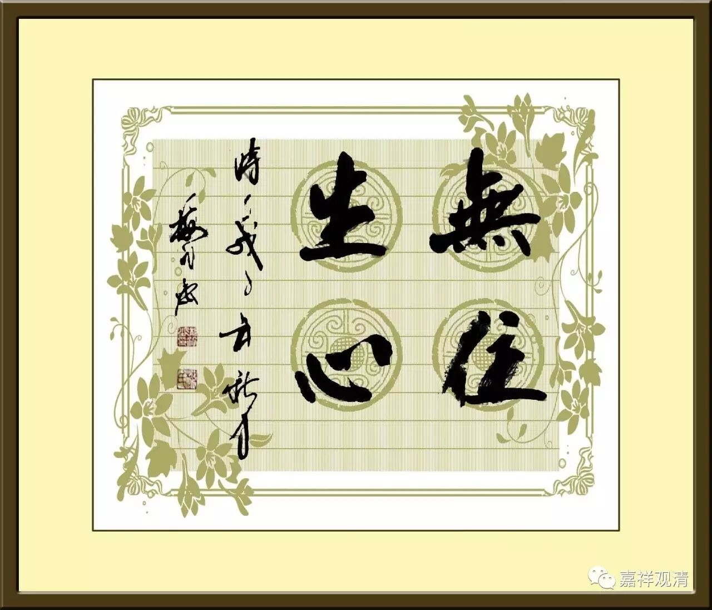

**《金刚经》032（中）**

** “须菩提，于意云何，菩萨庄严佛土不？”**菩萨庄严佛土吗？前面我们讲了，八、九、十这三地主要做的三件事是“严净国土、成熟有情和成满大愿”。第一个“严净国土”，在这里叫庄严佛土。我们通常都是用“严净国土”来说三清净地的菩萨。

为什么称为“三清净地”呢？因为据中观应成派来讲，八、九、十这三地的菩萨的烦恼障已经全部断完了，所以从这个方面来说，他不再被烦恼所染，所以就称为“三清净地”。这时候唯独要断的就是所知障了。

** “‘须菩提，于意云何，菩萨庄严佛土不？’‘不也，世尊。’”**须菩提说：不是这样的。** “何以故？庄严佛土者，即非庄严，是名庄严。”**三清净的菩萨，他在“庄严佛土”这件事情上固然是有，是有为法，但是他见不见其“实有”呢？他不见其“实有”，也还是证得无为法。

** “是故须菩提，诸菩萨摩诃萨，应如是生清净心：不应住色生心，不应住声、香、味、触、法生心，应无所住而生其心。”**这句话是被误读比较多的。** “应无所住而生其心”**，现在很多法师都把它拿出来讲：“哎呀！不要执着，不要认真，不要太认真。”是这个意思吗？完全不是！

** “应无所住而生其心。”**三清净地的菩萨，他是如何生心的呢？他是在做严净国土、成熟有情、成满大愿这些事情的。因为他要利益众生，所以他要“严净国土”，使他将来的报身的佛土庄严清净。他也要“利乐有情”，要度众生，要不然他将来成佛以后的佛土一个众生都没有。当然不仅仅是这个原因，他本身的大愿也就要成熟有情。“成满大愿”也是一样，包括各种各样的大愿：“乃至什么什么时候我不成佛”、乃至“这个世界如何如何”……那么多的大愿他都要去满足，就要在因地上去修行，所以说需要严净国土、成熟有情和成满大愿。

那么，在这些事情被他做的时候，他是不是起实有见呢？是不是认为这些东西是实有的呢？不是的！他不认为这些东西是实有的，所以说** “应无所住而生其心”**，是这个意思，并不是什么“哎呀！不要执着……”之类的意思。即使在做这些事情的时候，三清净地的菩萨会有什么情况呢？他可以刹那之间就观察到诸法的无自性。比如说在“严净国土”的时候，他就可以观察到：“哦，这些法都是无自性的。”而佛是不需要“刹那”的时间，佛是同时可以认识到“空”“有”、二谛的。

** “应无所住而生其心”**，“无所住”是什么意思呢？无所住，是指这些事物上没有自性，它们不是实有的，不是自性有的。“生其心”是什么意思呢？是指菩萨还需要去做严净国土、成熟有情、圆满大愿这些事情。这才是“无住生心”！

