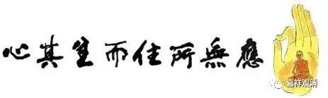

**《金刚经》032（下）**

而今天有些法师讲课的时候，或者我们自己学习的时候，听到** “应无所住而生其心”**，就会认为：“哎呀！我们要** ‘应无所住而生其心’——**做事情不要执着，不要太当回事，放下！放下！”这根本就不是佛教。如果这是佛教，那佛教有什么意思啊？！这是没水平，哪里谈得上一点佛教的味道啊！

我们再回过来讲。前面先是说** “一切贤圣皆证无为法”**，或者说** “一切贤圣皆以无为法而有差别”**。以无为法而有差别，就是证了无为法，然后在有为法上显出各贤圣的差别。然后座下的人就有一些问题，于是回答了三个问题。

第一个问题，声闻乘是不是这样的呢？声闻乘从初果一直到四果，从须沱恒果一直到阿罗汉果，包括证得无诤三昧的阿罗汉，怎么样呢？都是证得无为法的。他们不会在证的时候认为所证是实有的。

第二个问题，以中观应成派来讲，第七地的菩萨在智慧上也超过阿罗汉了，他是不是也证无为法了？也是一样的，他也是证无为法。那么，第七地的菩萨，比如说释迦菩萨，在燃灯佛面前得授记这件事情，是有还是没有呢？你总不能承认它没有吧？回答就是：即使得授记，也是无所得，或者也是证得无为法。

第三个问题就是，前面七地是这样，那八、九、十这三地呢？八、九、十这三地的严净国土、成熟有情、成满大愿也是要通达自性无的，在这三件事情上也不是认为是实有地去做。三清净地的菩萨能刹那刹那证知一切法的自性空，或者说这三件事情上的自性空，他们是可以刹那刹那了知的。

所以这里在讲什么呢？“一切贤圣皆以无为法而有差别”，是这个意思。首先，一切贤圣都是证得无为法的，然后他们在世俗谛上有没有差别呢？是有差别的。但是如果你不证无为法，你根本就不是贤圣。那什么是证无为法呢？这里主要就是指证空性。所以，** “应无所住而生其心”**绝不是什么泛泛的“这个事情不要去想啦，应无住生心”，不是这个意思哦。这种思想是一种人生态度，不是我们真正的佛教。

好，今天先到这里，谢谢大家！

