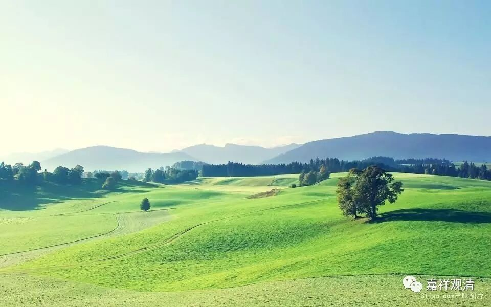

**《金刚经》 033（上）**

** **

好，我们继续《金刚经》吧。

前面在讲** “一切贤圣，皆以无为法，而有差别”**，也就是说** “一切贤圣皆证无为法”**，谈到了声闻乘的四果，又谈到了大乘的第七地，因为证得第七地的菩萨的智慧和福德都要超过声闻的阿罗汉（简称就是小乘阿罗汉）。那么，接下来就讲大乘的八、九、十这三地的菩萨。八、九、十这三地被称为“三清净地”，这三地的菩萨主要所做的事情是庄严国土、利乐有情、成满大愿这三件大事。

虽然这些圣者都是证得无为法的，但他们不是完全相同的，是** “皆以无为法，而有差别”**，什么差别呢？是显出他们各个所证得的功德的差别，或者说证得的果位的差别。小乘有初、二、三、四果，大乘有十地，对吧？

上面这些问题固然解决了，但是我们一般人还是会认为“你只是把声闻的问题解决了，把菩萨的问题解决了，那佛呢？”所以自然而然地，下面就会引发关于佛位的问题：“佛是不是有所得呢？”我们说佛得阿耨多罗三藐三菩提，成佛的“成”就是成就的意思嘛，成就佛果，获得佛果。所以还会有这样的问题：“佛位的获、得、成就这些，不是成就吗？不是实在地得一个东西吗？不是究竟地得一个东西吗？”

基于之前的说法，大家应该基本上清楚了：即使是佛位，也是无所得，是在胜义当中无所得，以这个无分别心去观察时，找不到任何有自性的存在。这也就是《心经》当中的** “无智亦无得”**。而在世俗当中呢，也是《心经》当中说的** “三世诸佛，依般若波罗蜜多故，得阿耨多罗三藐三菩提”**，还是要依靠般若波罗蜜多——智慧，最终证得阿耨多罗三藐三菩提——无上正等正觉。在胜义上呢，** “无智亦无得”**。缘起有而自性空，世俗有而胜义空。

智，就是一切种智，也是指佛的智慧，称之为佛也可以。** “无智亦无得”**的“得”呢，就是获得的意思，说成就也是一样的。在藏文版当中还有一个** “亦无不得”**，也没有“不得”。不得什么呢？比如说“不得”一个凡夫或者有情。

