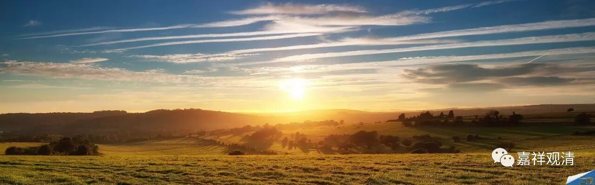

**《金刚经》032（中）**

接下来就是第七个问题了：“究竟佛地，获无边色身，岂非有法可得？”我们说，成佛了就有佛的无边色身，有三十二相、八十种好，或者说圆满的相好，那么，这“无边色身”不是有法可得吗？那我们说成就佛的报身，到底是不是有法可得呢？答案我们已经知道了，胜义上不得，但世俗上是有的，因为有为法必然是有因有果的。

那么接下去有一长段，这一段是非常的长，一直要到** “忍辱波罗蜜多”**的前面结束，所以我恐怕要讲很久了。我们先把文字先过一遍吧。

这一段的问题是：“究竟佛地，获无边色身，岂非有法可得？”我们来看正文。** “‘须菩提，譬如有人，身如须弥山王，于意云何，是身为大不？’须菩提言：‘甚大，世尊。何以故？佛说非身，是名大身。’”**

** **

这个“大身”是什么呢？就是成佛的色身。按照大乘来讲，就是在第四禅的色究竟天成佛的十地菩萨的色身。我们可以从《华严经》看到，十地菩萨在四禅天的色究竟天，有无边功德的色身，是大得不得了的色身，也是无量功德所积累的色身，然后在十地菩萨这一生成佛的。那么这个色身呢，就是很大的，** “身如须弥山王”——**非常非常高大。

释迦佛就问须菩提：“佛的无边色身大不大呢？”须菩提很清楚地回答说：** “甚大，世尊。”**是很大的。** “何以故？佛说非身，是名大身。”**也是因为诸法的无自性，佛的这个无边色身也很大，然后才说这个是“大身”。什么意思呢？也就是，有没有无边色身呢？有。无边色身是不是实有的呢？不是。所以** “佛说非身”**——也就是说这个身无自性；** “是名大身”**——它是缘起有的。

这就是我们一直讲的二谛。** “佛说非身”**是无自性，** “是名大身”**是缘起有。有法可得，是在什么地方讲呢？是在有为法上来讲的，是在世俗谛上讲的。无法可得，是在什么地方讲呢？是在胜义上讲的、自性空上讲的，比如说** “佛说非身”**，这就是在胜义上讲的。

接下来就是较量功德，整部《金刚经》当中较量功德的地方是非常多的。我们继续来看。** “‘须菩提，如恒河中所有沙数，如是沙等恒河，于意云何，是诸恒河沙，宁为多不？’须菩提言：‘甚多，世尊。但诸恒河，尚多无数，何况其沙。’”**

** **

须菩提啊，我来问你，恒河当中的沙多不多呢？像恒河沙这么多的恒河，然后它们的恒河沙多还是不多呢？也就是三重吧。首先是一恒河沙，然后像恒河沙这么多的恒河，再是这么多恒河沙的恒河的沙，多不多呢？

** “须菩提言：‘甚多，世尊。’”**很多啊！** “但诸恒河，尚多无数，何况其沙。”**别说最后那个恒河沙了，就是说像恒河沙这样多的恒河已经很多了，何况这么多的恒河沙呢。这个大家比较容易明白，就不多讲了。

