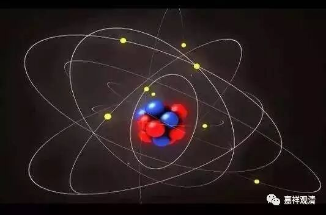
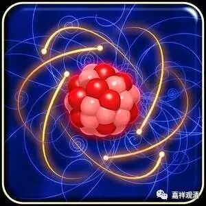
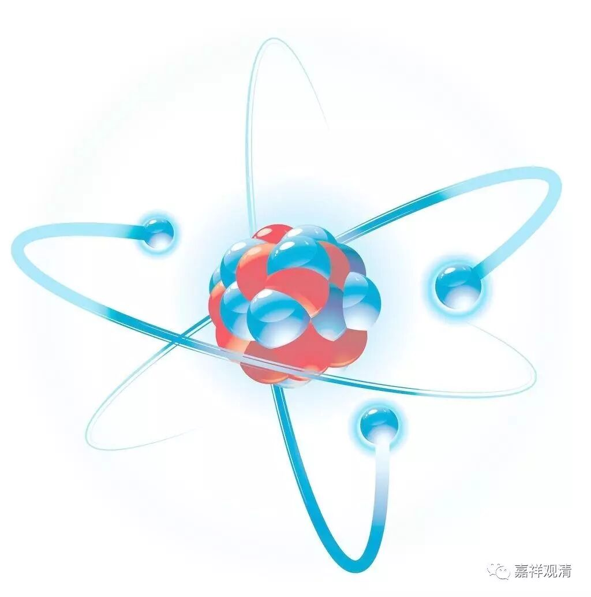

**《金刚经》035（上）**

好，我们继续《金刚经》。

现在这段是讲到了第七个问题：“究竟佛地，获无边色身，岂非有法可得？”前面已经回答了，佛的究竟色身也是胜义无而世俗有的。佛的色身有没有呢？是有的。佛的色身是不是实有的或者自性有呢？不是的。

接下来一段是较量功德，我们来看。** “须菩提，于意云何，如来有所说法不？”**也是一样的情况。虽然前面已经说了，“诸佛的色身也不是实有的”，听众当中还是有人没有明白，接下来就再发起新的提问——就是这样的背景。那么，对方会怎么认为呢？你说最终成佛也不是实有的，那么你今天的讲经呢？你现在又说有奉持，又说有讲经，那么“如来说法”，是有还是没有呢？就是说，对方一直还是没有理解“有”和“实有”的区别。他认为：“你这个也不承认，那个也不承认，那你今天的讲课，你总得承认吧？佛讲经，总得承认是有吧？”

基于这个情况呢，释迦牟尼佛和须菩提就继续演戏，佛陀就来问：** “须菩提，于意云何，如来有所说法不？”**如来说法这个事情，是有还是没有呢？是实有还是不是实有呢？** “须菩提白佛言：‘世尊，如来无所说。’”**这又是一对问答。这一对问答就是为了针对有些下面的听众的想法：“哎，那如来有没有说法呢？”这个回答的意思是说，如来所说的法不是实有的，“有”和“实有”不是一回事。如来所说的法有没有呢？有。如来所说的法是不是实有的呢？不是实有。为什么呢？很明显，“如来说法”也是缘起的，比如说，要有说法的人、说法的对象、所说的内容，才能成立“如来说法”这件事，“如来说法”，也是“三轮体空”。

** “须菩提，于意云何，三千大千世界所有微尘，是为多不？”**这个“微尘”是什么呢？这个“微尘”就是后来所翻译的“极微”，“微”，就是细小的，“尘”就是境，“微尘”，就是最小的物质。后来玄奘法师翻译成“极微”。“极微”的“极”就是终极，“微”就是微小，“极微”就是终极微小，相当于以前古希腊时代所提出的原子。“原子”就是“原”初最小的粒“子”，“极微”就相当于这个——物质的最小单位。

这句话的意思就是：所有的“微尘”或者“极微”，以此为质料、基础元素，构成三千大千世界，这么多的原子，或者说构成三千大千世界的极微，数量多不多呢？** “须菩提言：‘甚多，世尊。’”**须菩提回答说“太多了！师父！”。

