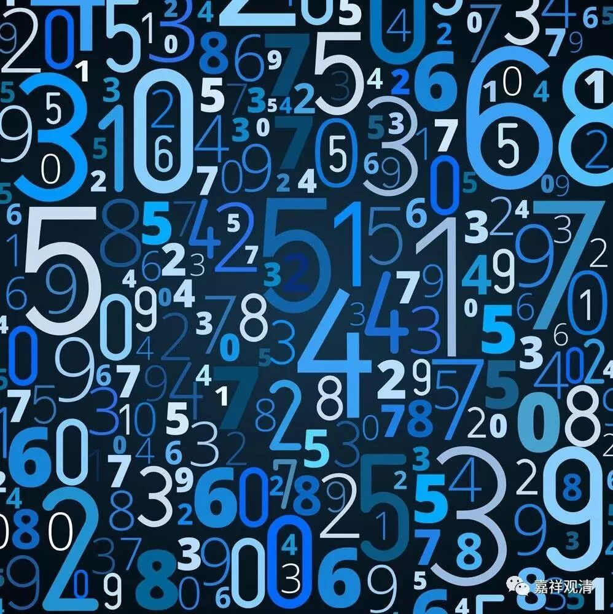
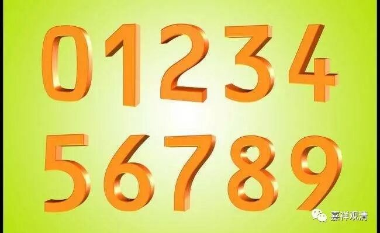

**《金刚经》035（中）**

在佛教当中，特别是在大乘佛教当中，是怎么说极微的呢？极微是不是实有的呢？大乘，无论中观唯识，都说极微不是实有的！唯识说：它是我们分析出来的。极微的本质就是物质的最小单位，但实际上这个最小单位你是可以无限地分下去的，并没有一个最小单位。那么，这个极微到底是什么呢？就是我们意识分析的极限。所以极微色就被称为法处所摄色当中的一个，是吧？

** “须菩提，诸微尘，如来说非微尘，是名微尘。如来说世界，非世界，是名世界。”**这个微尘就是极微，也就是诸极微。** “如来说非微尘，是名微尘。”**这极微是什么呢？它不是实有的，这就是如来所说的极微。它是我们概念当中的一个产物，是我们对事物或者物质进行思维分析而得到的最小单位，实际上是没有的，并不存在所谓的物质最小单位。

** “如来说世界，非世界，是名世界。”**如来谈世界也是一样的。** “说世界”**——如来讲“世界”这个事情，** “非世界”**——世界不是实有的、胜义无，** “是名世界”**——它是“唯名言有”的，或者说“缘起有”的。

这里的“世界”，指的是物质世界，一般我们说它是由极微所造成的，或者说由原子等造成的。既然是由极微所造成的，那么这个世界就不是实有的，为什么呢？因为世界是要依赖于极微这个条件而有，对吧？必须要依赖于形成它的这些最基本的元素而有。这个元素不是指的分子，而是这里讲的最基本的极微，类似于原子。所以，这个世界就不是实有的，为什么呢？它要依赖其他的条件而存在，如果是实有的话，就是不依赖其他的条件而存在的。那么极微呢？极微也是一样的。前面我们讲了，极微是要依赖于我们的观念，就好像东南西北等等，是我们概念分析的一个产物，这个能理解吧？再举个例子，比如数字，1，是我们抽象出来的概念，它不独立存在，是基于我们抽象的分析而来，数字，依赖于具体的事物而存在。可以这样理解。

